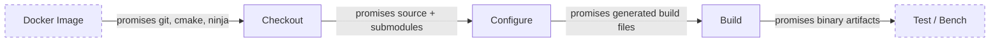

Last time I explained why I am writing a game engine from scratch in 2026. Two weeks have passed. The code is not any better. But now I have CI. At least I thought I did.

<!-- truncate -->

## TL;DR

- A CI workflow written in late July had a matrix of 15 configurations. It did exactly one thing: `actions/checkout`.
- The Docker image for Sega Mega Drive did not contain git. Checkout fell back to the REST API, logged one line about it, and carried on. Submodules broke. Nobody screamed.
- Over two weeks the pipeline went from a stub to building on four platforms: Linux, macOS, Windows, and Sega MD.
- Side effects: the images got a linter, smoke tests, and documented environment variables.

## The Sprint Plan

- [x] Build workflow skeleton (the platform matrix)
- [x] Fix the MD Docker image (git, cmake, ninja)
- [x] Build the engine on all platforms
- [x] Push workflow for main
- [ ] Benchmarks and tests: the placeholders are there, the steps are not

## Part One. The Crime

It was a Thursday evening. The first blog post was up. The site worked. The engine compiled locally. I opened the repository to check on CI and found a file called `build_cmake.yaml`. A hundred and twenty-two lines.

It looked solid. A matrix of 15 configurations. Windows MSVC x64 and x86. macOS Xcode and Ninja on arm64 and Intel. Linux Ninja x64 and arm64. Seven console targets on top: MD, GBA, NDS, 3DS, Switch, GameCube, Wii. Containers, timeouts, `secrets: inherit`. Impressive.

One problem. The job body contained a single step: `actions/checkout`. No configure. No build. No test. Fifteen configurations checked out the code and went home. A CI pipeline that builds nothing is a charming artifact. It is not, however, very useful.

I figured adding configure and build would take half an hour.

I was wrong by two weeks.

## Part Two. The Investigation

### False Lead No. 1: "Just Add the Steps"

The first thought was obvious. Add `cmake --preset` and `cmake --build --preset` to the job body. The presets were already in `CMakePresets.json`. The Ninja generator was already there. What could go wrong?

I pushed the change. CI fell over. Not on configure. Not on build. On checkout.

The log was strange. `actions/checkout` printed: "The repository will be downloaded using the GitHub REST API. Input 'submodules' not supported when falling back to download using the GitHub REST API." The Docker image `toygine2.md.toolchain` did not contain git. At all. Checkout, finding no git in the container, switched to downloading a tarball through the REST API. Tarballs do not do submodules.

Why checkout does not stop

`actions/checkout` tests for git in PATH. If git is missing, it does not fail. It does not warn. It logs one informational line about the REST API and swaps strategies. The REST API tarball method is faster and needs no git. It also breaks on `submodules: recursive`. Which is what happened.

The behavior is documented. But who reads the checkout docs before it breaks?

### False Lead No. 2: "Install Git in the Image"

I opened `Dockerfile.md` and added git to the final stage. Then I checked the consumer side, the engine repository. One tool was not enough.

First, every preset in the engine uses the Ninja generator. The image had no `ninja-build`. Second, `cmake_minimum_required` demanded 3.27, and `bookworm/main` shipped 3.25.1. If checkout had not failed first, configure would have. If configure had somehow passed, build would have.

The packages went in: `ninja-build`, `git`, `ca-certificates`, `cmake` from `bookworm-backports`. But while I was fixing the image, a third false lead appeared.

### False Lead No. 3: "Pin Versions and Lint"

Hadolint, the Dockerfile linter, insisted on two things. Pin every apt package as `pkg=version` (rule DL3008). Use `WORKDIR` instead of `cd` (DL3003). Both sounded sensible.

I checked. Debian `main` carries only the current version of each package. After a security update, the string `git=1:2.39.5-0+deb12u3` stops resolving. The build breaks. Not just one job. Every job, including ones with no connection to the package that changed.

The fix was a `.hadolint.yaml` with ignored rules and a reason next to each. The linter exits clean. It does not dictate a policy that breaks reproducibility.

### False Lead No. 4: The Reviewer Bot

While all this was happening, the reviewer bot kept filing comments. Some were useful. Others were not. The useful ones I fixed and moved on. The others I checked, and each check turned up something interesting.

**"`ubuntu-26.04` does not exist. Roll back to 24.04."** The CI on `ubuntu-26.04` was green. `gh api .../actions/runners` confirmed zero self-hosted runners. `ubuntu-26.04` is a real GitHub Actions labelset. The docs are behind. The same bot said nothing about `macos-26` or `windows-2025`.

**"Set `cancel-in-progress: false`, or a new push will cancel an active deploy."** Half right. `true` cancels the run already in flight in the same concurrency group; `false` cancels nothing and lets runs queue instead. But branch builds should die when the branch moves on, and the GitHub Pages deploy is already serialized by its own job-level group with `cancel-in-progress: false`. Flipping the workflow-level flag would only pile up stale branch builds.

**"Remove `-DBENCHMARKS_OUTPUT_FILE`. Nothing reads it."** Also true. Not a single `CMakeLists.txt` in the repository consumes that variable. But this is not a bug. It is a placeholder. The CI has four of them: `run_benchmarks`, `bencher_testbed`, `run_test`, `BENCHMARKS_OUTPUT_FILE`. Removing one makes the file less consistent. They are all waiting for the first benchmark.

**"`secrets: inherit` hands out every secret for nothing."** Here the bot had a point, but not the whole one. `pull_request.yaml` called `build_cmake.yaml` with `secrets: inherit`, while the callee declared no secrets and contained a single checkout step. Inherit acted as a pass-through corridor from the PR workflow into the reusable one, handing out tokens nobody was going to use. I postponed the fix. The job body was filling up with configure and build steps. Soon it will have secrets that need the corridor. But the question hung in the air. What else in my workflows is living its own life while nobody is watching?

## Part Three. The Eureka

On the fourth day I understood. I was not fixing bugs. I was fixing contracts.

CI is not a pile of scripts. It is a chain of promises components make to each other:

Every discovery of the past few days was a broken contract, not an isolated bug. Git in the image: the image's contract with checkout. Ninja and cmake: the image's contract with configure. `permissions: pull-requests: write` in `build_cmake.yaml`: a contract nobody planned to honor. `secrets: inherit` in `push.yaml`: a contract handing out every repository secret for no reason at all.

The nasty part is how these failures show up. None of them breaks CI loudly. Checkout switches to the REST API and reports it as a detail. CMake prints "Manually-specified variables were not used by the project" and moves on. Unused permissions do not cause errors. Quiet bugs. Waiting for the right moment.

Miss Marple notices when something is off in the village, even when everyone is smiling and having tea. Turns out the same approach works for CI.

## Part Four. The Resolution

By the end of the sprint, `build_cmake.yaml` had gone from a stub to a working pipeline.

- **Linux** (x64 and arm64). GCC 16 through `eatmydata` with an APT cache.
- **macOS** (arm64 and Intel). Xcode with cascading version selection.
- **Windows** (x64 and x86). MSVC through `vswhere`.
- **Sega Mega Drive**. Inside the `toygine2.md.toolchain` container.

A `push.yaml` workflow now builds on every push to main. Unlike `pull_request.yaml`, it needs no PR comment permissions, just `contents: read` and `packages: read`. But `secrets: inherit` stays. The matrix already has `run_benchmarks` and `bencher_testbed`, and the Bencher token is almost certainly arriving that way. For now it is a corridor to nowhere, but a corridor with a sign that says "opening soon." A `.hadolint.yaml` keeps the Dockerfile linter clean. The GBA image got a smoke test: `mgba-headless --version placeholder.gba`. The binary is verified in the same layer that built it.

## What Went Wrong

- **The site deploy rebuilds Doxygen on every push.** Editing a blog post triggers a checkout of the engine with submodules, a Doxygen 1.17 install, cmake configure, and a build of the `docs` target. HTML and dot graphs are generated and thrown away. I need a flag override for speed.
- **Five devkitPro images have no smoke tests.** They consist of `FROM` plus `LABEL`. The upstream toolchain goes unchecked.
- **The `build_cmake.yaml` body still has no test steps.** Four matrix placeholders are waiting for the first benchmark.

## Benchmarks (None Yet)

| What                        | Before         | After                                |
| --------------------------- | -------------- | ------------------------------------ |
| Platforms in CI             | 0 (local only) | 4 (Linux, macOS, Windows, MD)        |
| Build steps                 | 1 (checkout)   | 4 (checkout, prep, configure, build) |
| Docker images with a linter | 0              | 7                                    |
| Smoke tests in images       | 0              | 1 (GBA)                              |

The real before/after table arrives when Bencher.dev goes live with the first benchmark. For now I am picking off the easy ones: configure and build times on each platform.

## Plans for the Next Two Weeks

- Bencher.dev: register the project, add `BENCHER_API_TOKEN`, set thresholds.
- Self-hosted runner on a Linux mini-PC for stable benchmark timings.
- Move Obsidian vault notes (`decisions/`, `structure/`, `context/`) into the site docs.
- Smoke tests for the remaining Docker images (NDS, 3DS, Switch).

## A Question for the Community

There is one thing that bothers me. When CI fails silently, the way checkout without git switches strategies instead of crashing, that I can understand. Scary, but reproducible.

The flip side worries me more. `secrets: inherit` in a workflow that uses no secrets. `permissions` nobody asked for. `-DBENCHMARKS_OUTPUT_FILE` that nothing reads. It is dead code at the infrastructure level.

How do you deal with this? Do you have a linter for CI workflows that catches unused variables and permissions? Or is it just "notice and fix" on gut feel? I would love to hear your approach. I have about two weeks until the first benchmarks land, just enough time to clean house.
