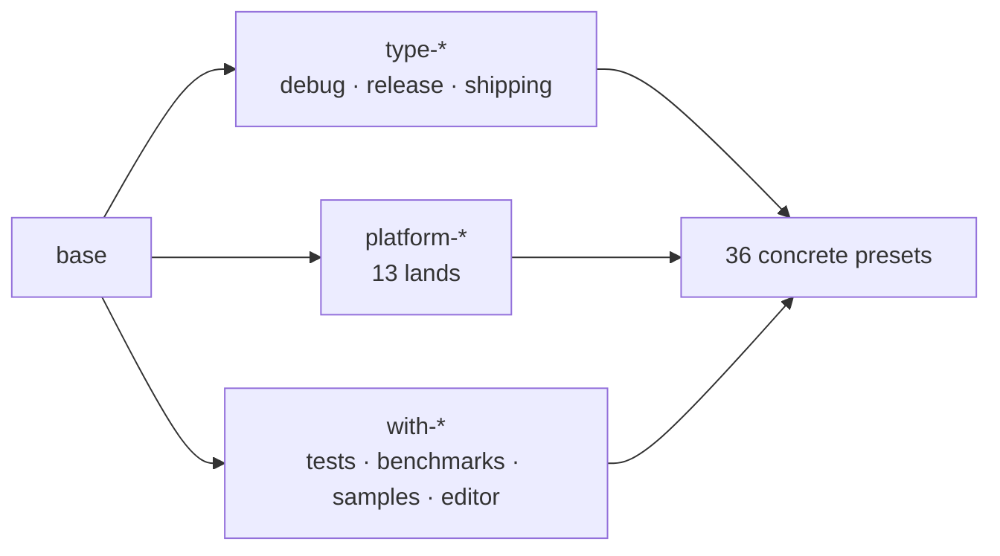

ToyGine2 is a game engine for retro consoles. The settlement stands at the crossroads of thirteen lands, from Game Boy Advance and the Mega Drive to Windows, macOS and Linux. Back then it had no road a foreign ship could follow to the pier on its own.

<!-- truncate -->

## What happened

This tide cycle I charted the archipelago along three axes, set a watchman over the scrolls who no longer keeps quiet, and opened the harbor to seven foreign ships. There were more spirits than I bothered to count past the middle of the cycle: one pretended to be the land of the Nintendo 64, one swapped the cargo and left the seal intact, one barred a messenger from his own hearth. By the end of the cycle a tablet had been carved and carried into the house of knowledge. [Here is the shelf it rests on](https://github.com/ToymanInteractive/toygine2/releases/tag/26.16.0).

**Plan for the cycle:**

- Chart the build presets along three axes: type, platform, component set
- Make the documentation build a gate rather than a report
- Bring the Docker images to a state where CI actually runs on them
- Assemble the skeleton of a matrix build across every target platform

## A map along three axes

Before this, there was no map at all. To build the settlement for another land I kept the order of the words in my head and recalled it fresh each time. My recollection, to be honest, was not always right.

I laid the roads out along three axes. The first says what the house is like inside: `type-debug`, `type-release`, `type-shipping`. The second says which land it stands on: thirteen `platform-*` entries, from Windows on two architectures to the Mega Drive, the Nintendo 64 and the Wii. The third says what it holds beyond walls: `with-tests`, `with-benchmarks`, `with-samples`, `with-editor`. Thirty-six concrete presets stand where the axes cross.

The map refused to work. `cmake --list-presets` printed nothing and failed outright: the file version, it said, had to be three or higher. Eight presets already carried a `toolchainFile` while the header still said one. I had drawn roads the format itself knew nothing about.

That turned out to be the small problem. The spirit sat deeper, and for three days I did not see it.

Presets inherit, and I was certain the later ancestor wins a conflict, because that is how nearly every inheritance I had met before worked. CMake resolves the conflict in favor of the **earlier** one. The shared ancestor `base` stood first in the list of all thirty-six presets and quietly overrode everything after it: `TOYGINE_BUILD_*` stayed `OFF` despite a declared `with-tests`, and the generator came out as Ninja everywhere, even though `macos-xcode` announced Xcode and the Windows presets announced Visual Studio.

The worse part came next. I had built a whole theory on it: MSVC and Xcode are multi-config, so `CMAKE_BUILD_TYPE` is ignored there. The theory was true in substance, but it rested on the generator that was *declared* rather than the one that came out. As for the table of effective cache variables, I computed it with a script of my own, and the priority in that script ran backwards. I was checking a mistake with the same mistake.

The ritual was shorter than the diagnosis. `base` moved to the end of `inherits` in all thirty-six presets, the file version rose to three, and `cmake_minimum_required` went from 3.19 to 3.27. Three shipping presets appeared: before them, MSVC and Xcode could not be configured without the editor, tests, samples and benchmarks all at once. Thirty-six visible build presets appeared as well. Their absence had already brought CI down, because `cmake --list-presets=build` printed nothing, the documentation step failed with `No such build preset: "linux-debug"`, and back then the step was simply deleted.

This time I checked with live runs instead of reasoning. `macos-release`: `TOYGINE_BUILD_*` went from `OFF` to `ON`. `macos-xcode`: the generator went from Ninja to Xcode, and a real `ToyGine2.xcodeproj` appeared on disk. `gba-release`: the cross target was untouched. Ever since, I read effective values out of `CMakeCache.txt`, out of what came about rather than what is written down.

The last spirit of this theme was the quietest. `cmake --preset n64-debug` finished successfully. The Nintendo 64 branch in `ConfigureCompiler.cmake` was empty, `platform-n64` was the only retro target without a `toolchainFile`, and the build went ahead on the system `/usr/bin/c++`. The settlement stood on sand and claimed to stand on stone. The empty branch now ends in a `FATAL_ERROR`, and `n64-debug` honestly returns one.

A settler sees none of this. They type `cmake --preset macos-release`, one line. The order of ancestors is no business of theirs, and that is the whole point: a map is drawn so that nobody has to read it later.

## A watchman over the scrolls

Scrolls had been written in the settlement for a long time, and I was the only one reading them closely. Doxygen answered "all is well" no matter how many complaints it had: `WARN_AS_ERROR` sat at `NO`, and `WARN_LOGFILE` carried the complaints off into a file nobody opened. A broken `\param` gave a zero exit code and an empty console.

So I set a watchman: `WARN_AS_ERROR = FAIL_ON_WARNINGS_PRINT`. Not `YES`, which halts at the first warning and would have me working through them one run at a time. `FAIL_ON_WARNINGS_PRINT` prints the whole list first and only then fails.

The watchman spoke, and CI fell the same day: `clang: Failed to parse translation unit` on two files. My first thought was the obvious one and it was wrong: that the new strictness had broken the build. All it broke was the silence. The same errors had been sitting there before; under `WARN_AS_ERROR = NO` they simply never touched the exit code. The culprit was `CLANG_ASSISTED_PARSING`: it only takes effect in CI, because the official Doxygen binary is built with libclang and the one on my machine is not. An option whose behavior depends on whose hands built the tool is an option I turned off.

The second spirit lived in the messenger rather than the scrolls. The Doxygen tarball was fetched with a plain `curl`, no `--fail`. On a 404 or a 500, `curl` returns zero and dutifully writes the error page body into `doxygen.tar.gz`. The guard `|| { echo "Failed to download Doxygen"; exit 1; }` had never once fired: the messenger brought the wrong cargo with the seal intact, and the failure surfaced a step later as a baffling `tar: not in gzip format`.

The rest of this theme is smaller masonry. `Doxyfile` is now generated into the build directory rather than the source tree, where two presets used to fight over one file. `DOT_PATH` moved inside quotes, because Windows paths contain spaces. `MERMAID_RENDER_MODE` switched from `AUTO` to `CLI`: Doxygen was injecting an `import mermaid` from jsDelivr into every page of the site, with exactly zero diagrams in the repository. The workflow itself moved from `push` to `pull_request` and stopped spawning draft releases out of every branch.

From the outside all of this looks like a documentation site that simply exists. A silent charm and a working charm look identical from there, right up to the day a spirit walks past.

## The harbor and the foreign ships

Seven console toolchains live in containers here, and six of them are built on the devkitPro image, by other hands and long ago. The seventh, for the Mega Drive, I assembled myself on a bare `debian:bookworm-slim`. It was also the only one with a user of its own inside, and that is where this began.

The runner mounts its working directory into the container and creates service files there under its own name, mode `0755`, user id 1001. It starts the container without naming a user, so inside, my `builder` with user id 1000 does the work. Writing into someone else's directory was, naturally, beyond `builder`. What failed was not the container start but `actions/checkout`, on the attempt to save its own state, with an inscrutable `EACCES`. A messenger was barred from the hearth in the house opened for him. I dropped the `USER` directive.

Then it emerged that `actions/checkout` runs the `git` from the image itself, and the final stage of the MD image had no `git` at all. Without it, checkout quietly falls back to fetching an archive over the REST API. It does not complain or warn, it simply takes another path. You learn about the substitution later and from another direction: `Input 'submodules' not supported when falling back to download using the GitHub REST API`. That path cannot do submodules.

The ritual took one Dockerfile layer and half a day of checking. `git`, `ca-certificates`, `curl`, `xz-utils`, `unzip` and `ninja-build` moved into the final image, the last of them because every engine preset goes through Ninja. `cmake` took more work: Debian main carries 3.25.1 while the engine needs 3.27 or newer, so `cmake` installs on a separate line from backports and arrives as 3.31.6. The build stage deliberately stayed on the old `cmake`: it compiles the assembler and ClownLZSS, whose `cmake_minimum_required` lines hold ancient numbers.

Two more spirits in the same image turned out to be about courtesy toward neighbors rather than about building. The first was the variable `PREFIX=/opt/clownmdsdk`. In the build stage it was redundant, since all four ClownMDSDK stages export it themselves. In the final image it was dangerous: the image mounts somebody else's project, `PREFIX ?= /usr/local` in a consumer's Makefile respects the environment, and someone's `make install` would have driven straight into the SDK directory. The variable now goes by `CLOWNMDSDK`.

The second spirit of that pair was `LANG=en_US.UTF-8` in an image with no `locales` package. I checked inside the container: `locale -a` knows only `C`, `C.utf8` and `POSIX`, while `LANG=en_US.UTF-8 locale charmap` answers with three errors and a fallback to `ANSI_X3.4-1968`. UTF-8 was never switched on at all, and `makeinfo` had good reason to grumble during the binutils build. `C.UTF-8` lives inside glibc itself and costs zero bytes.

The Game Boy Advance image, meanwhile, was missing a charm. The build stage compiled `mgba-headless` and copied the finished binary into the final image without ever running it, and had done so since the file first appeared. I added `mgba-headless --version placeholder.gba`. The argument is required, and it is not a slip: in the mGBA sources the version check sits *after* the empty-filename rejection, so a bare `--version` prints usage and exits with one. The file `placeholder.gba` does not exist and should not, because the version branch returns before the emulator goes looking for a core. The run takes 0.1 seconds and prints the version together with a commit hash; the hash matches the pin in the Dockerfile, so the charm guards against pin-and-layer drift as well.

A settler sees a green check mark. They know nothing of user ids, nor that the `git` inside the image is not the `git` they use at home. What makes a harbor is whether a foreign ship can enter it without asking you anything first.

## The rest of the cycle

CI permissions needed separate attention. The top level of the calling workflow sets the ceiling: anything unlisted there is implicitly nothing. A permissions block inside a reusable workflow only declares a requirement and cannot grant above that ceiling.

The skeleton of a matrix build came together across fifteen configurations, fifteen shores on thirteen lands, because some lands take two ships each: Windows on two architectures, macOS through Xcode and Ninja on both arm64 and Intel, Linux on x64 and arm64, plus seven console targets in containers. A runner preparation step appeared: `vswhere` and the path to `dumpbin` on Windows, a cascade of Xcode versions on macOS, `gcc-16` through `update-alternatives` on Ubuntu. APT packages are cached so they are not pulled every run. The date in an image tag is now computed once. It used to be computed twice, and a build starting just before UTC midnight could get yesterday's tag with today's version label.

## Dead-end trails

The trail through the mangroves: splitting the documentation build in two

The idea was a good one: `docs-html` and `docs-xml` as separate targets over a single template. I even measured the gain, 0.74 seconds for the XML run against 1.38 for HTML. It never reached the commit: the change was reverted, and rightly so, since the site needs both formats anyway and there would now be two places to keep in sync.

Whispers about seals (a false trail)

Three times in a row I was advised to pin CI actions by commit hash instead of tag. Taking the advice apart, I found something curious: an annotated tag resolves in two steps, and a naive replacement substitutes the hash of the tag object rather than the commit. The advice itself aimed the wrong way, though. It proposed pinning the actions written by GitHub, while the third-party ones stayed on tags.

The land that supposedly does not exist

Twice during the cycle I was told the runner label `ubuntu-26.04` does not exist and that I should fall back to 24.04. By then three successful runs in a row were sitting on that label, and later twenty green jobs out of twenty. Unfamiliar is not the same as nonexistent; that was worth settling with a run, which is what I did.

Scaffolding around an empty lot

The build matrix contained a `-DBENCHMARKS_OUTPUT_FILE` argument that no `CMakeLists.txt` reads. Six jobs dutifully reported the variable as unused. Digging further, I found that the dead thing is not the variable but the whole enterprise: there is no `benchmarks/` directory in the repository and no run steps either. Four placeholders stand in the matrix waiting for a house that has not been built. I left them standing.

## Reef health

| What I measured                        | Before                     | After                     |
| -------------------------------------- | -------------------------- | ------------------------- |
| `cmake --list-presets`                 | fails on file version      | 36 configure + 36 build   |
| `TOYGINE_BUILD_*` in `macos-release`   | `OFF` despite `with-tests` | `ON`                      |
| Generator in `macos-xcode`             | Ninja                      | Xcode, project is created |
| `cmake --preset n64-debug` on the host | succeeds on `/usr/bin/c++` | exits with 1              |
| A broken `\param` in Doxygen           | exit 0, empty console      | fails with the full list  |
| Configurations in the build matrix     | 0                          | 15                        |
| mGBA smoke test in the GBA image       | none                       | 0.1 seconds               |
| External CDN references in the docs    | on every page              | 0                         |

## The kohau

The tablet of this cycle is carved and rests in the house of knowledge, built the way they built them on Aotearoa. Little is written on it: a build system, a tide beacon standing over it, and the thinnest editor imaginable, a window that opens with a menu holding almost nothing. For a first tablet that is enough; there are no genealogies on it yet for anyone to continue.

## Lands beyond the horizon

Next I meant to finish what the matrix was built for: running the tests and the benchmarks, shipping the measurements outward, ROM tests for the Game Boy Advance on a real emulator. I wanted console applications on the NDS, the 3DS and the Switch, whose toolchains already stood in the harbor, waiting. And there was a separate design in mind for clocks: one source of time across every platform, something a frame could be driven from.

I am writing this down years later, and I will not pretend to say which of it turned into what.

## A question for the community

More than half the spirits of that cycle were of one breed: a tool answering "all is well" where all was not. `curl` returned zero on an error page, Doxygen returned zero with a log full of complaints, checkout switched paths without a word, the N64 preset built on the system compiler and gave no sign. Each time I learned of it by accident and later than I should have.

You who are building now: how do you catch that? Is there a way to find the silent successes early, before they surface elsewhere and under another name? In all these years I have found nothing better than checking by hand, here and there, and I very much hope I am wrong about that.
