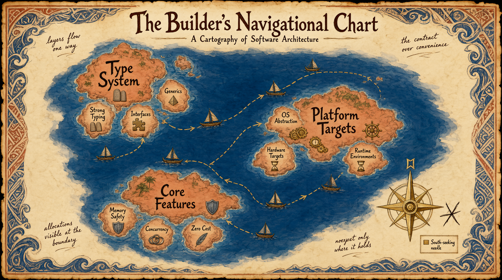

ToyGine2 is a game engine for retro consoles. The settlement stands
at the crossroads of fifteen platforms: from Game Boy Advance to Steam
Deck, from Windows to the Nintendo 64. The Builder is only beginning
to sift through the ruins.

<!-- truncate -->

## What happened

This tide cycle, the Builder rewrote the settlement's laws from
a foreign tongue into the language of this land, charted the
archipelago in three dimensions, and lit a lighthouse now visible
from every island. Along the way, three ships received names and
stopped sinking in the harbor. The artifact of the twenty-sixth
cycle has been left in the vault.

**Today's plan:**

- Rewrite the settlement's code of laws
- Chart the build map for every platform
- Fix the failing harbor

{/*
ДЛЯ ЧЕЛОВЕКА: что снять — карта архипелага как метафора матрицы CMake-пресетов
FOR AI: Ancient navigational map on aged parchment, Polynesian wave motifs along borders, Moana-inspired palette of deep indigo ocean and terracotta islands with gold compass rose, Ghibli hand-drawn linework, Zelda dungeon-map clarity, three island chains labeled type/platform/features connected by dashed trade routes, a small compass rose pointing south instead of north with a correction mark scratched beside it, marginal notes in elegant script, parchment texture, editorial blog header, 16:9
*/}

## The law over the water

The old laws were written for a different land. They spoke of widgets
and pubspecs, words nobody in this settlement had ever heard. The style
guide prescribed Flutter. The architecture rules spoke of Presentation
and Domain layers. The testing rules said `flutter test`. The settlement
lives by different laws, but the scroll was silent about them.

The Builder set about rewriting.

C++ came first. Twenty-five rules instead of a dozen: views and spans,
monadic error flow, deducing this, compile-time contracts. Not a catalog
of new standard features but a living code: what to use, when, and why.

Then the engine itself. Nineteen rules of runtime architecture: how time
flows within a frame, why determinism is not a property of code but
a discipline, how component storage is laid out, what happens at
the boundary between render and simulation. Rules you cannot formulate
until you have built at least one house.

Then the public API. Thirteen rules: call-site first, minimal surface,
strong types at the boundary, visible allocations and errors. The contract
matters more than convenience.

Engine architecture: twelve rules of static structure. Unidirectional
layers: platform → core → services → systems → gameplay → tools.
An acyclic module graph. The engine as a library: no `main`, no window,
no command-line arguments.

Testing, documentation, error handling. Each section was rewritten not
by translation but by rebuilding from the foundation.

The rules were not merely written. They were verified. Each claim was
checked against the actual repository. The statement about `noexcept`
went through three revisions before matching reality: exceptions are off
in the build, but you mark `noexcept` only where non-throwing is
guaranteed. Redundancies were hunted down: the same prohibition on
`reinterpret_cast`, described across five sections, collapsed into
a single cross-reference. Links were audited by script: 152 targets,
two broken.

By the end of the cycle, the code of laws was no longer foreign. It
speaks of what is built, not what one might wish to build.

## The map of the archipelago

Thirty-six CMake presets. Three axes: `type-*` (debug, release, shipping),
`platform-*` (thirteen targets from Windows x64 to Nintendo 64), `with-*`
(tests, benchmarks, editor, samples). A map covering every point of the
archipelago.

The map did not work.

`base` sat first in the inheritance list of every preset. CMake resolves
conflicts in favor of the earlier entry, and `base`, which declared
`Ninja` as the generator and all build options off, silently overrode
everything `platform-*` and `with-*` declared. No preset built the tests.
The Xcode preset generated Ninja files instead of an `.xcodeproj`. Four
sessions passed. Nobody noticed.

The spirit was not in the water. The spirit was in the inheritance order.

Once `base` was moved to the end of `inherits` across all thirty-six
presets, the map came alive. `macos-xcode` started generating a real
Xcode project. `windows-msvc` produced Visual Studio solutions. Tests,
samples, and benchmarks lit up where they were meant to.

A separate case: the Nintendo 64. The `n64-debug` preset had no
`toolchainFile` and silently compiled under the system `/usr/bin/c++`,
masquerading as cross-compilation. The branch in `ConfigureCompiler.cmake`
received a `FATAL_ERROR`. Now attempting to build an unsupported target
fails loudly instead of pretending to succeed.

The lesson drawn from this day and sealed in the scroll: verify
configuration against `CMakeCache.txt`, not by reasoning. The defect
went unnoticed for four sessions precisely because the build succeeded.
Not to the right target, not with the right options, but succeeded.

## Ships in the harbor

Seven Docker images, one for each console platform. The Sega Mega Drive
image was the only one built on `debian:bookworm-slim`, and the first
to fall.

{/*
ДЛЯ ЧЕЛОВЕКА: что снять — Docker-образы как корабли в порту, маяк как CI
FOR AI: Harbor scene at twilight, Polynesian double-hulled ships with distinct insignia representing console platforms, Moana-inspired turquoise water with coral reef below, terracotta sails and gold trim, Ghibli hand-drawn watercolor texture, seven ships docked — six intact, one listing slightly with a visible crack in its hull being repaired by a tiny figure, a massive gentle whale surfacing near the harbor entrance (subtle Docker mascot homage), a lighthouse on the rocky shore casting a beam of golden light across the water, parchment-like sky with ink-wash clouds, editorial blog header, 16:9
*/}

The first fall: `EACCES`. The GitHub Actions runner bind-mounts its
working directory from the `runner` user (uid 1001), but the image
switched to `builder` (uid 1000) and lost access. Solution: remove
`USER` from the image. The rule of non-root execution, which had seemed
universal, shattered against the reality of job containers.

The second fall: `git: not found`. `actions/checkout` runs git from
inside the image, and the final stage of the MD image didn't have it.
Without git, checkout silently falls back to a REST API tarball, which
cannot handle submodules.

The third: no `ninja-build`. The fourth: cmake from `bookworm/main`
(3.25.1) falls short of the minimum 3.27. Both were found in
`bookworm-backports`.

The fifth, and subtlest: `ENV PREFIX=/opt/clownmdsdk`. The image mounts
a foreign project, and `PREFIX ?= /usr/local` in consumer Makefiles
respects the environment. One stray variable, and `make install` drifts
into the SDK directory. The variable was also unnecessary: upstream
exports `PREFIX` during its own build, and the consumer hardcodes the
path. Solution: `CLOWNMDSDK` instead of `PREFIX`, with a rule in the
code of laws: "`ENV` is named after its SDK; generic names are forbidden."

The sixth: `LANG=en_US.UTF-8`, which does not exist in
`debian:bookworm-slim`. `locale charmap` fails with an error and falls
back to `ANSI_X3.4-1968`. UTF-8 is off, `makeinfo` complains.
Replacement: `C.UTF-8`. Zero bytes, because it lives inside glibc itself.

The Game Boy Advance image received a smoke test: `mgba-headless --version
placeholder.gba`. The dummy argument is mandatory: mgba checks the file
before printing the version, and without one it prints usage and exits
with code 1. As a side benefit, the test verifies that the baked-in mGBA
commit matches the one declared in the Dockerfile.

The lighthouse had its own troubles. The CodeQL reusable workflow
required `security-events: write` permissions the caller did not grant.
Concurrency groups were configured with different keys across three
workflows. `curl --fail` was missing, and HTTP 404 was silently written
into a tarball. The Doxygen build had been failing on clang parsing for
years, and nobody saw it, because `WARN_AS_ERROR` was set to `NO`.

By the end of the cycle, the harbor was working. A matrix of fifteen
configurations (Windows, macOS, Linux, and seven consoles in containers)
stood ready.

## Dead-end paths

The mangrove path (non-root in Docker images)

The original premise, "images should run unprivileged," shattered
against GitHub Actions. The host runner and the container live under
different uids, and checkout fails on `saveState`. Setting uid 1001
fixes GitHub-hosted runners and breaks everything else. Fixing the
consumers shifts the burden onto every workflow. Decision: images do
not set `USER` at all.

Spirit whispers (false duplicates in the code of laws)

Three sessions in a row, the Builder found redundancies in the code of
laws, and three times the fixes remained unapplied. The repetitions were
intentional: each section is read autonomously; the rule about `\ref`
belongs both in the cross-reference section and in the concept
documentation template. Only on the fourth session was a compromise
found: keep the unique remainder, replace the duplicate with
a cross-reference.

A false trail (SHA-pinning GitHub Actions)

Three times during the cycle, a suggestion came to replace action tags
with SHAs. Three times it was rejected: every action in the repository
is pinned by tag, and SHA-pinning is updated by dependabot anyway. It
is a question of administrative policy, not security. On the third round,
a discovery: `v4.36.2` is an annotated tag, and its SHA points to the
tag object, not the commit.

## Health of the reef

| Metric                    | Before          | After                    |
| ------------------------- | --------------- | ------------------------ |
| CMake presets             | 3 (single axis) | 36 (three axes)          |
| Platforms in CI matrix    | 0 (docs only)   | 15                       |
| Docker images             | 7 (one broken)  | 7 (all working)          |
| Rules in the code of laws | ~40 (Dart)      | ~150 (C++23/game engine) |
| Lines in the code         | ~900            | ~650 (after dedup)       |
| Doxygen: CI gate          | none            | fail on first warning    |

## Chronicles

The artifact of the twenty-sixth cycle,
[release 26.16.0](https://github.com/ToymanInteractive/toygine2/releases/tag/26.16.0),
has been left in the vault. The ships in the harbor are named, the map
of the archipelago is drawn.

## Lands beyond the horizon

The code of laws is unfinished. Section by section, rules are still
migrating, folding together, being audited. Broken links trail from the
twenty-eighth day. `CMakeLists.txt` carries a `TOYGINE_BUILD_BENCHMARKS`
option while the `benchmarks/` directory does not exist. Seven images
await versioned tags instead of `:latest`.

Beyond the horizon: the first tests, the first code outside `core`,
the first run on real hardware.

## A question for the community

The Builder returns to the fire and spreads out the map. Thirty-six
presets, fifteen platforms, each with its own toolchain, its own
generator, its own container. The lighthouse is lit, the ships are
afloat.

"Those of you who have built settlements at the crossroads of
platforms," the Builder says, "how do you manage the build matrix?
Do you keep presets for every `type × platform × feature` combination,
or do you compose them in layers? And where does your Nintendo 64
live?"
