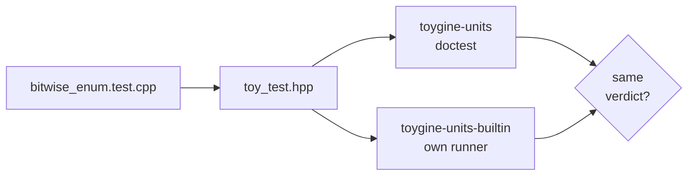

Over two weeks I took eight consoles down from the shelf, one per pull request. I'm writing ToyGine2, an engine for small games that should run on modern machines and on the consoles from that shelf. This cycle the engine got a test runner of its own, and each of the eight consoles got an image built in CI.

<!-- truncate -->

[In short](#short) · [A test runner of my own](#runner) · [Tests reach the GBA](#gba) · [One sample, eight consoles](#samples) · [Numbers](#numbers) · [What's next](#next)

## In short {#short}

The engine has its own test runner now. It builds where doctest can't, and it reaches the same verdict. On desktop the tests are built under both runners at once, and on the GBA the test ROM runs in CI under mGBA. The console sample builds for eight consoles, and each one gets its own image on the pull request. All of it went into 26.18.0, and [the release is on GitHub](https://github.com/ToymanInteractive/toygine2/releases/tag/26.18.0).

- Artifacts of a closed pull request are deleted right away instead of after seven days. A branch named something like `main&event=push` can no longer rewrite the API query parameters.
- There is a Docker toolchain image for the Wii U. CI now checks that the base image tag in `FROM` matches the image label: Dependabot had bumped the tag in `Dockerfile.gba` and left the label alone.
- The Wii U never showed up in the platform list. The find module set `DEVKITPRO_WIIU_FOUND`, and the check looked for `DEVKITPRO_WII_U_FOUND`.
- Almost every pull request added one MSVC flag: `/GF`, `/GL`, `/GR-`, `/GS`, `/guard:cf`, `/Gw`, `/Gy`, `/RTC1` and a few more.
- CI runs clang-format 23, and it no longer lifts a file's "own" header above the standard ones.
- A script in CI catches module tests that reach into the runner's internals.

## A test runner of my own {#runner}

On desktop the engine's unit tests run under doctest. On the consoles there was no test binary at all. The test files didn't even compile with their toolchains, so the `static_assert`s in them never fired there.

First I checked whether doctest would do. With devkitARM for the GBA and 3DS it built and linked into a ROM. With ClownMDSDK for the Mega Drive it didn't: that's a freestanding environment, without `<signal.h>`, `<ctime>` and the rest of what doctest expects. Strictly, only the Mega Drive needed a runner of its own, but I wrote it for every console. Otherwise every change to the tests would start with the question of which runner sits on which platform. The narrowest target set the limits: no heap allocations, and from the standard library only the six headers ClownMDSDK has.

The runner's main rule is that the same test reaches the same verdict under doctest and under it. I tripped over that rule almost at once. I'd written `Approx`, the comparison with a tolerance, from memory, and review found it didn't match the doctest 2.5.3 source:

```cpp
// before
difference <= epsilon * max(1.0, larger)
// after, word for word as in doctest
difference < epsilon * (1 + larger)
```

The two look alike, but near 1.0, at a difference of one and a half epsilons, doctest says "equal" and mine said "not equal". No existing test changed its verdict, so the mismatch would have lived until the first test right at the threshold. A compile-time check now guards the formula.

Review also suggested going the other way and computing everything in `double`, as doctest does. I measured it and said no. The Mega Drive's 68000 has no FPU, and a single comparison of two `float`s would grow from 168 to 248 bytes of code. The cost would land on exactly the console the runner was written for, so I left that narrow precision gap in place and documented it.

So the rule doesn't rest on my word, the desktop build compiles the same test set twice: as `toygine-units` under doctest and as `toygine-units-builtin` under my runner. On the first test file I moved over, the built-in runner reported `1..7` and `passed=18`, and doctest reported `test cases: 7 | assertions: 18`. Changing `0xFF` to `0xFE` in one check broke both targets. It's how you test a new gear against the old one: put both on the same arbor and see whether the teeth line up.



<details>
<summary>The subcase test that passed with a bug twice</summary>

The case `each_subcase_runs_exactly_once` checks that the runner enters each subcase exactly once. I rewrote it three times. The first version leaned on global counters, and the next two passed with a planted bug. The second compared the context counters, and a runner that entered the first subcase on every pass produced the same numbers. The third kept only the last subcase name per pass, so a pass that entered both the first and the second subcase looked as if it had entered only the second. The fourth version worked: every pass gets a record with a name and an entry count.

</details>

A green run tells you nothing about whether a test catches anything. I now check the runner's tests with planted bugs before I call the work done. For someone writing a game on the engine it comes down to one line: a test includes `toy_test.hpp` instead of doctest, and the same file runs on desktop and on a console with the same verdict.


## Tests reach the GBA {#gba}

Once the tests were built twice, CI showed something odd. Locally there were 64 tests, in CI there were 57, and the built-in runner printed `1..0`, zero cases. The only thing that failed was coverage, with `lcov: ERROR: (empty) no valid records found in tracefile`.

A CMake filter was to blame. The runner's own files were kept out of the module tests by matching `/runner/` against absolute paths. My checkout lives under `/Users/…`, but GitHub checks the code out into `/home/runner/work/…`, where every file's path contains `/runner/`. I reproduced it on a copy of the tree under the same kind of path and switched the file search to relative paths anchored with `^`. Someone suggested adding lcov's `--ignore-errors empty`. I turned that down: the empty coverage report was the only thing that had noticed the tests were gone.

Next the test binary had to build for the consoles, and the plan's shared `main` didn't survive the Mega Drive. The cartridge linker script declares `_EntryPoint` as the entry point, there's no C runtime to call `main`, and the binary came out with no start address. The entry point moved into per-platform files, nine of them in `tests/runner/platforms/`, one per platform. CMake picks the right one, and on a platform it doesn't know, configuration fails instead of silently building the desktop version.

The GBA was the first console where the tests actually ran. For CI I'd already designed a step that builds `mgba-rom-test` from the mGBA sources. Then I looked inside the GBA toolchain image and found `mgba-headless` there, the same tool under another name. I threw the whole step away.

What remained was teaching the ROM to talk to the emulator without breaking it on hardware. At startup the ROM writes `0xC0DE` to the debug register at `0x04FFF780`: mGBA answers `0x1DEA`, hardware stays silent. Under the emulator every report line also goes to the debug log in full, while the 30-column screen gets it cut short. At the end the ROM makes the Stop system call, `swi 3`, with the verdict in `r0`, and `mgba-headless -S 3 -R r0` turns it into the process exit code. I had to write that call in assembly, because libgba's `Stop()` overwrites `r0` on the way.

```cpp
asm volatile("mov r0, %0\n\tswi 3" : : "r"(code) : "r0", "r1", "r2", "r3", "memory");
```

I gave the run to CTest rather than to a CI step, so the `Unit testing` step is the same on every platform. A green run is ten report lines and exit code 0. A broken check gives `not ok 7` with the file, line and expression, and exit code 1.

The empty lcov report looked like broken coverage and was really a broken test build. Had I silenced it, CI would have stayed green while building zero module tests. For someone writing a game, this means every pull request runs the engine's tests on an emulated GBA, and the same ROM on a flash cart shows its report on the console's screen.


## One sample, eight consoles {#samples}

At the start of the cycle only the nine desktop builds had an artifact on a pull request: download the archive, run the console sample. The consoles built, but there was nothing to hold. Over the cycle I took down one console per pull request: GBA, NDS, 3DS, Switch, GameCube, Wii, Wii U and Mega Drive.

The sample is small. It brings up the SDK's text console, prints a line and waits in the main loop. Each console has its own loop. The GBA has nowhere to exit to, so it waits for the vertical blank forever, and the NDS spins in `pmMainLoop()` until the system asks it to quit. The build branches mirror each other: an SDK function turns the ELF into a console image, and `install` puts it in `bin`. Out come `.gba`, `.nds`, `.3dsx`, `.nro`, `.dol` for GameCube and Wii, `.rpx` for the Wii U and `.bin` for the Mega Drive.

The first surprise was an archive inside an archive. `actions/upload-artifact` always zips whatever it gets, and it was getting a zip from CPack. The `archive: false` input uploads the file as is and names the artifact after the file. I expected the matrix's `artifact_id` field to become redundant after that, and it became more important instead. Without it CPack names the package after the system and processor, and Xcode arm64 and Ninja arm64 both turn into `Darwin-arm64`. Two identical names in one run break the upload.

The second was the GameCube. I'd guarded the sample's branch with `__GAMECUBE__`, everything built without a single warning, and only review noticed that devkitPro's CMake toolchain for libogc defines `__gamecube__` in lowercase. It's the only devkitPro platform spelled that way. `nm` on the ELF confirmed it: no `VIDEO_Init`, no `SYS_MainLoop`, and the `.dol` had shipped the desktop branch with `<iostream>`.

When a macro picks the branch, a clean build tells you nothing about which code went into it. Checking the symbols took a minute, and I now look in the binary for this kind of thing, because a green tick won't show it. For anyone who wants to see the engine on their own console, every pull request carries 17 archives, eight of them with a console image. You can open it in an emulator or put it on a flash cart.


## Numbers {#numbers}

| What I measured                          | Before                          | After                                          |
| ---------------------------------------- | ------------------------------- | ---------------------------------------------- |
| Tests in the desktop set, Aug 22 → 27    | 32                              | 64                                             |
| Tests in CI with the `/runner/` filter   | 57, built-in runner `1..0`      | 64, `1..7`                                     |
| Checking the runner's report             | 1.02 s, three separate binaries | 0.06 s, one doctest unit                       |
| Comparing two `float`s on the Mega Drive | 168 bytes of code               | 168 bytes; the `double` version (248) declined |
| Builds with a pull request artifact      | 9                               | 17                                             |

## What's next {#next}

The Mega Drive is next in line. It already has an entry point and output through the video chip's debug register. What's missing is an emulator that runs without a window and hands back a verdict. The other six consoles will follow the GBA pattern: a branch in `tests/CMakeLists.txt` and `run_test: "true"` in the CI matrix.
