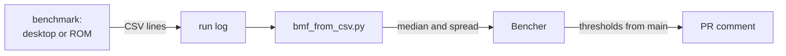

For two weeks the jeweller's loupe hardly left my forehead. I'm writing ToyGine2, an engine for small games that should run on modern machines and on the consoles from my shelf. This cycle went to strings: making them build on the Mega Drive, making them behave like the standard ones, and making their speed measurable.

<!-- truncate -->

[In short](#short) · [A Mega Drive without libc](#md-libc) · [StringView against std::string_view](#string-view) · [Benchmarks for consoles](#benchmarks) · [Numbers](#numbers) · [What's next](#next)

## In short {#short}

`StringView` gained search, comparison and UTF-8 character counting, and all of it builds on the Mega Drive, which needed the missing part of its libc written. A brute-force comparison with `std::string_view` found 27 mismatches and one crash; now there are none. The engine has benchmarks on nanobench and a pipeline that sends the results to Bencher, and for the consoles there is the groundwork of a timer of its own that needs no floating point. All of this went into 26.19.0, and [the release is on GitHub](https://github.com/ToymanInteractive/toygine2/releases/tag/26.19.0).

- `CStringView` was renamed to `StringView`.
- The assertion handler returns `true` when execution should stop, the way Microsoft's `_CrtDbgReport` does.
- The built-in test runner prints its report in TAP 14, a plain-text test reporting protocol.
- `toy::utf8Len()` counts UTF-8 characters, and `toy::validateUtf8()` checks a string against table 3-7 of the Unicode standard.
- New types: `application::Version` with comparison, `log::Level` with the `LOG_MAX_LEVEL` ceiling, and `log::Metadata`.
- `FixedStringStorage` and the `StringStorage` concept lay the ground for a heap-free string.
- ckdl and the Vulkan headers live in `thirdparty/`, which is also where the old `extern/` moved. The editor now ships in CI artifacts.
- The editor's project manifest is designed: spec #78 and eight tasks, #79–#86.
- Assertion handlers in the tests no longer throw from a `noexcept` function, which used to kill the whole test binary.
- macOS builds get `-O2`, `-g` and `NDEBUG` again; empty flag variables had been silently overriding them.

## A Mega Drive without libc {#md-libc}

The Mega Drive build in CI failed on `#include <cstring>`. The header from ClownMDSDK, the development kit for this console, didn't compile at all: it contained `using memcpy;` with no qualification. Calling `::strncpy` directly didn't help either, because the SDK had no `strncpy` anywhere, neither a declaration nor an implementation.

Then it turned out that `libc.a` in the SDK is a stub of 1,824 bytes. It holds exactly three functions, `memcpy`, `memmove` and `memset`, the ones GCC emits calls to on its own. `memcmp`, `memchr` and `strlen`, which `std::char_traits<char>` relies on, and `StringView` with it, were missing.

The fix went into the engine repository, on top of the installed SDK. It is an overlay: its own `string.h` and `cstring`, placed ahead of the SDK in the include path, and its own `string.c`, compiled into the engine library. The code gained no platform `#ifdef`s; the seam runs along a file. I checked the map file to confirm the override also holds at link time: `memcpy` and `strncpy` come from the engine library, and `libc.a` is loaded but contributes no members.

I checked each new function against the host libc by brute force: every string of length four over `{a, b, c, \0}`, every pair, every length from zero to five, all 128 character values. There were no mismatches. Upstream had a worse bug than the missing functions: `cstdlib` carried the include guard of `cstring`, so after `<cstring>` the second header silently vanished. The fixes sit in my fork of the SDK, and the upstream PR isn't open yet.

One mistake was my own. I gave the overlay the `-std=gnu17` dialect and wrote in a comment that `string.c` had `asm` blocks, which strict C17 lacks. Three days later it turned out there had never been any `asm` there. I dropped the flag, the overlay builds under `-std=c17`, and the ROM came out the same size.

A kit for a console with no operating system promises less than its header names suggest: having `cstring` in the SDK tree doesn't mean anyone ever included it. For someone writing a Mega Drive game, this is what changed: the standard string functions work, and engine code written for the desktop builds there without platform branches.

## StringView against std::string_view {#string-view}

`StringView` is a view of a null-terminated string, a relative of `std::string_view` that also guarantees `c_str()`. This cycle it got element access, `compare`, `starts_with` and the whole search family: `find`, `rfind`, `find_first_of` and the rest, with four overloads each. Its behaviour has to match the standard one byte for byte, and tests built from hand-picked examples can't prove that.

The red phase caught the first bug before any comparison ran. All nine overloads of the backward searches defaulted to `pos = 0`, but a backward search bounds where a match may start. With zero, `rfind("abra")` only found a match at the very start of the string. The default became `npos`, as in the standard.

Then I wrote a differential harness: the same inputs go into `toy::StringView` and `std::string_view`, and the results are compared. A new gear gets checked the same way: it goes on one shaft with the factory gear, both turn together, and a tooth that doesn't line up shows at once. The first run over search, on every string of up to four characters over `{a, b, c}` and every position, found no mismatches.

For the second run I built without `_DEBUG`, that is with assertions off, and added the positional `compare` overloads with counts all the way up to `npos`. It found 27 mismatches and crashed. The minimal repro is `a.compare(0, npos, b, 0, npos)`: the second count wasn't capped at the length, and `memcmp` was asked for `SIZE_MAX` bytes. `std::string_view` returns zero for the same call. 19 of the mismatches came from the five-argument overload: with two empty parts and different counts, it declared the left one smaller. Counts are now capped at the length, as in the standard, and the mismatches are gone. A run over the rest of the API under ASan and UBSan came out clean too.

I checked the tests themselves with mutations: break a method and see whether the suite notices. On the iterators the suite caught eight breakages out of eight; on search, three slipped through. One of them involved a character with the high bit set: none of the 122 tests sent one through a character-set search. Each got its own test case.

A harness checks exactly what it enumerates: the first run was clean because its counts never reached `npos`. For someone writing a game, search and comparison in `StringView` give the same answers as the standard ones, including on empty strings and on `npos`.

## Benchmarks for consoles {#benchmarks}

Search in `StringView` worked correctly, but I knew nothing about its speed: the `benchmarks/` directory had no benchmarks in it. I needed measurements on the desktop and on the consoles, and nanobench won't build on a console. It needs a host clock, iostreams and floating point, and the 68000 and ARM7 have none of these.

I started with nanobench on the desktop: one binary, with cases that register themselves. My first numbers came from a debug build without a single `-O`, where the same change showed a 14× speedup; in release it was 8×. Since then the rule is written down: measure release only.

The measurements paid off right away. `find` switched to finding the first character with `traits_type::find` and went from 405 to 55.7 ns. For `rfind` I nearly adopted the libc++ strategy, which scans forward and remembers the last match. A case with the needle at the end of a 4 KB text showed the price: 4.08 ns for the backward scan against 992 ns for libc++. The backward scan stayed, and I made each position cheaper by checking the first and last byte of the needle before the comparison.

On the desktop nanobench prints a table, while the console runner prints CSV lines of integers: timer ticks and call counts. A script on the CI host computes the median and spread and builds the report for Bencher. Later I compacted the format so the case and row names are written once instead of once per epoch. The mGBA debug log set the number of epochs: it cuts a line at 256 bytes, and with eleven epochs the longest line doesn't fit, so there are seven.

The clocks differ between consoles. On the GBA it is Timer 2 with no prescaler, cascaded into Timer 3 so the 16-bit counter doesn't overflow within an epoch. On the Mega Drive it is a frame counter plus the video chip's line counter. Inside VBlank the line counter repeats values, so the timestamp holds still there, as in SGDK. The optimizer barrier `sink = &value` didn't work: the assembly showed AppleClang, `m68k-elf-gcc` and `arm-none-eabi-gcc` all removing the computation entirely. An empty `asm volatile` statement replaced it.

One oddity I never explained. For four builds in a row, the set of cases in the binary moved the `compare` measurement from 3.99 to 26.48 ns, and on the fifth build the effect vanished. I checked CPU load and stack alignment and ruled both out. So I compare numbers only within one table from one build, where the `std` row serves as the control.

A character table for find_*_of: built and rolled back

A 256-bit mask instead of rescanning the set for every byte made `find_first_of` and its siblings 3.7–4.3 times faster and made them 3–6 times faster than `std`. I had no way to check it on the consoles. On ARMv4T a mask lookup costs 12 instructions with 64-bit words against 6 with 32-bit ones, and on the 68000 a variable shift costs 8 + 2n cycles for every byte. I rolled it back entirely and will return to it once the console runner works.

A number means nothing without the build it came from: a debug build lies, neighbouring cases interfere, and only the `std` row beside it keeps a measurement honest. On `main` the runs set thresholds, and each PR is compared against them. An alert doesn't block the merge; it stays a note in the comment. For someone writing a game, the engine now has a way to find out what a call costs, and the same `*.benchmark.cpp` will later go to the GBA and the Mega Drive.

## Numbers {#numbers}

| What I measured          | Before                  | After                 |
| ------------------------ | ----------------------- | --------------------- |
| `find(s, pos, count)`    | 405 ns                  | 55.7 ns               |
| `find(char, pos)`        | 40.4 ns                 | 5.12 ns               |
| `rfind`, 103 bytes       | 165.9 ns                | 43.0 ns               |
| `rfind`, 4 KB            | 6,524 ns                | 2,110 ns              |
| CSV report of a full run | 287 lines, 22,651 bytes | 27 lines, 6,418 bytes |

Search times are from macOS, in release.

## What's next {#next}

The storage and the concept are ready, and the `toy::String` type itself will stand on them next. The benchmark bodies will move onto the engine's own `Bench`, and the GBA and Mega Drive will get runners that launch them in emulators. There is also a debt: `_DEBUG` is only defined for MSVC for now, so on every other platform the assertions in a debug build check nothing.
