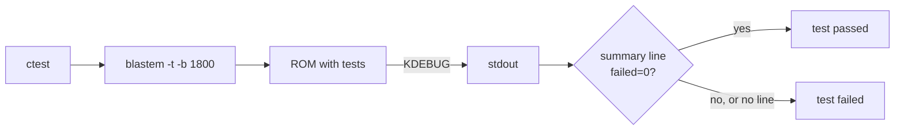

For two weeks the Mega Drive stood off its shelf, on the corner of the workbench. I'm writing ToyGine2, an engine for small games that should run on modern machines and on the consoles from that shelf. This cycle its tests passed on the Mega Drive for the first time, the string type got assignment, and the build stopped going to the network.

<!-- truncate -->

[In short](#short) · [Tests on the Mega Drive and GBA](#consoles) · [The string that didn't fit](#string) · [Every dependency in the repository](#vendoring) · [Numbers](#numbers) · [What's next](#next)

## In short {#short}

The engine's unit tests now run in CI under a Mega Drive emulator, and on the GBA they run against a free BIOS instead of mGBA's built-in stand-in. `toy::FixedString` got constructors and assignment modelled on `std::basic_string`, and it still never touches the heap. No `FetchContent` is left in the build: every dependency lives in the repository. All of this went into 26.20.0, and [the release is on GitHub](https://github.com/ToymanInteractive/toygine2/releases/tag/26.20.0).

- The MD and GBA toolchain Docker images build on native arm64 GitHub runners instead of under QEMU.
- There is now an N64 toolchain image: libdragon from the `preview` branch with GCC 16.2.
- The engine's two test binaries became one, and the `TOYGINE_TESTS_RUNNER` option picks the runner.
- The editor has its own test target, `editor-units`, and the first piece of the project model: the settings registry.
- Benchmarks are written against `toy::benchmark::Bench`. On desktop it is nanobench; without nanobench it is a built-in timer that will later go to the consoles.
- Bencher comments on a PR only for Linux x64 and on an alert, instead of posting seven identical reports.
- The `toy::` re-exports of `std::array`, `std::char_traits`, `std::min` and five other names are gone; call sites use `std::`. This is a breaking change.

## Tests on the Mega Drive and GBA {#consoles}

On the GBA, the engine's tests had been running under mGBA in CI for about a month by then. For the Mega Drive I built the BlastEm emulator into the toolchain Docker image and set up the same kind of run. The CI step kept failing on a timeout, `units-builtin ***Timeout 60.06 sec`, with not a single line of output.

I did the first round in CI itself, with a temporary step running `set -x` and `blastem -h`. It told me little: the `-b` flag, which runs a given number of frames without a window, isn't in the help text, and there was no output at all. After that the investigation moved to a local container, where building the ROM and running it takes about a second.

A ladder of frame counts settled it. `-b 5` exited at once with code zero, while `-b 60` and `-b 1800` hung until the timeout. So frames were being counted and the emulation was alive, and everything stopped at the point where the runner prints the first line of its report.

The ROM writes report lines to a debug register on the video chip, and BlastEm prints them as `KDEBUG MESSAGE`. Before each of those prints it calls `init_terminal()`. If stdin and stdout aren't a terminal, BlastEm closes the standard streams, forks xterm and waits on a FIFO for it to connect. The CI container has no X server, so xterm never starts, and the process waits forever with stdout already gone. That explained the empty log. The fix is the `-t` flag, which `blastem -h` doesn't list either: I found both flags only in the source.

Once the hang was gone, a second hole showed up. BlastEm always exits with code 0, and the test didn't check its output, so after `-t` it would have passed with any number of failures. The verdict now comes from the text.

The runner prints `# assertions passed=N failed=0` last, so a single regular expression in `PASS_REGULAR_EXPRESSION` catches both failed checks and a run cut off halfway. I tried it on an old ROM with one failing check: the test went red, CTest returned 8 and put the whole report in the log.

The GBA got a full BIOS in the same cycle. mGBA used to stand in for it with its own emulation; now the image carries emibios, a free replacement for the original BIOS. The first run with it dumped 192 lines of `GBA DMA` from the boot animation into the log. The `-C skipBios=1` option skips the animation, while system calls still go through the BIOS code. The price is that CI no longer checks booting through the BIOS.

First hypotheses: a dead 68000 and a broken cartridge header

While the log stayed empty, I suspected the ROM itself: either the CPU wasn't starting or the cartridge header was built wrong. The `-l` flag should have written an address trace, but the file stayed empty because the process was killed before it flushed the buffer. The frame ladder ruled out both hypotheses. A dead CPU wouldn't have made it to a clean exit on frame five.

An emulator in CI is a dependency just like the compiler, and it behaves in ways without a terminal that aren't documented anywhere. I no longer trust an emulator's exit code until I have seen the test fail. For someone writing a game on the engine, this is what changed: every PR runs 65 test cases and 391 checks on an emulated 68000 and ARM7, so a bug that only lives on the 68000 will show up before the merge.

## The string that didn't fit {#string}

`toy::FixedString<N>` is a string whose fixed-size buffer lives inside the object itself; it never touches the heap. This cycle it got every constructor and assignment from `std::basic_string`. That raised a question the standard string never faces: what to do when the text doesn't fit. `std::string` throws `std::length_error`, and exceptions are off in the engine.

I took the standard's guarantees as the model, as far as they can be kept without exceptions. When `std::string` hits `length_error`, the object is simply not created, and there is no partial result. So a constructor that runs out of room stops on `assert_message` in a debug build and leaves the string empty in a release build. I didn't truncate to `capacity()`, since the standard has no such half-answer. Assignment is different. There the string already existed, and when the storage refuses, the string keeps its old contents.

Then I looked at what a copy costs. By default `FixedString` copies its whole buffer. For a 16-byte string that is cheap, because the compiler unrolls the copy into a few instructions. For a `FixedString<4096>` holding eight characters, it is four kilobytes of wasted work. The storage now copies the whole buffer up to a threshold, and above it only `size() + 1` bytes. It works like screw boxes: a small one is easier to tip out whole, while with a large one it's faster to move only the filled compartments.

One threshold for everyone didn't work. 64 bytes hurts desktop, where clang unrolls even a 72-byte copy, and 72 hurts the GBA. So each platform now has its own `platform_config.hpp` with a `c_inlineCopyMaxBytes` constant. For the consoles I took the values from the code GCC generates: 28 to 60 bytes. For macOS I ran a grid of measurements and chose 128. Windows, Linux and Switch got 128 as an estimate for now, without measuring.

Along the way the storage constructor stopped zeroing the buffer and now writes only the terminator. On the GBA, `FixedString<256>` no longer pays for a `memset` every time it is created. That came back to bite me at once: a storage test compared the whole buffer, read the uninitialised tail and failed in CI in an optimised build, so I fixed the test.

The Mega Drive had its own surprise. The cut-down libstdc++ in the SDK ships `<ranges>` without the internal `bits/binders.h`, so the iterator-pair constructor didn't compile. I put the file into the SDK overlay in the repository unchanged. At `-O2`, all that's left of `ranges` in the MD and GBA code is a pointer subtraction and a `memcpy`.

A fast path for short strings: rolled back

The idea was to copy a short string as a fixed-size block. Clang merged both branches into one `memmove` of `max(size, block) + 1` bytes, and on macOS it got slower: 2.6–3.0 ns instead of 1.9. GCC for ARMv4T, without `std::assume_aligned`, copied the `char` buffer through a function call, and pulling in `<memory>` for that hint added 20% more preprocessed lines to the core umbrella header. On top of that I had tied the block size to `c_inlineCopyMaxBytes`, and those are different quantities.

Without exceptions, every operation needs a clear answer to "what's left after a refusal", and the standard's guarantees are the best source for that answer: the thinking is done, it only needs translating. For someone writing a game, `FixedString` behaves like `std::string` wherever that is possible without a heap. Overflow is predictable: the string ends up either empty or unchanged.

## Every dependency in the repository {#vendoring}

Until this cycle, CMake downloaded doctest, volk and the Doxygen theme during configuration. Everything else already sat in `thirdparty/`, but each module there was built its own way. Two mechanisms at once meant two versions of the truth: volk 1.4.350 arrived next to the Vulkan 1.4.362 headers.

I turned the rule around. `FetchContent` used to be the default; now dependencies are vendored only. The copy sits in `thirdparty/<name>/`, its module `thirdparty/<name>.cmake` sits next to it, and all modules follow one layout.

A copy holds only what gets built. The zlib copy is down to 20 files: the engine has its own I/O layer and doesn't need the `gz*` file API. libpng kept 29 files out of 380, doctest four, and the Doxygen theme 11 out of 41, without a 5.6 MB GIF. I stripped donor consoles the same way for years: you take the working board and leave the case and the power brick on the shelf.

Vendored code builds with the project's flags, `-Werror` included, and no `-w` to silence it. The zlib, libpng and volk copies passed without a single warning. The ckdl copy didn't: 13 errors from `-Wbad-function-cast` and `-Wassign-enum`, so it alone keeps `-w`, with the reason in a comment.

There was one trap with doctest. The test targets called `include(doctest)` to get `doctest_discover_tests()` from the upstream helper. As soon as `thirdparty/` joined the module path, that name started resolving to my new `thirdparty/doctest.cmake`, and configuration failed with `Unknown CMake command "doctest_discover_tests"`. The fix was to make the module a full replacement: it creates the target and pulls in the upstream helper itself.

Vendoring gives an offline build, and a trimmed copy under the project's `-Werror` also forces me to decide which third-party code I'm willing to read and maintain. The cost is that I now update the copies by hand. For anyone building the engine, the main change is that configuring after `git clone` downloads nothing, and the editor needs neither the network nor the Vulkan SDK.

<!--
ДЛЯ ЧЕЛОВЕКА: кадр темы про вендоринг, «деталь под лупой». Разобранная
донорская приставка: руки мастера вынимают одну маленькую плату, а пустой
корпус, блок питания и моток проводов сдвинуты к краю верстака. Пропорции
16:9, минимум 1600 × 900. Если генерация не сложится, подойдёт скриншот
дерева thirdparty в IDE.

ALT RU: Мастер вынимает одну плату из разобранной донорской приставки, пустой корпус и блок питания сдвинуты к краю верстака
ALT EN: The toymaker lifts one circuit board out of a gutted donor console, its empty shell and power brick pushed to the bench edge

ДЛЯ AI:
A workbench seen from over the toymaker's shoulder. In the centre lies a
fully disassembled grey 8-bit home console of invented design, its parts
spread out. The toymaker's hands, one holding a small screwdriver, lift a
single small green circuit board out of the opened lower shell and hold it
up into the lamplight. To the right, on a folded cloth, three other small
boards already rest side by side, clean and sorted. Pushed to the far left
edge of the bench are the parts that stay behind: the empty upper shell,
a heavy black power brick and a loose tangle of cables. A jeweller's loupe
on its headband lies next to the sorted boards. The lifted board is the
brightest point of the frame; the discarded shell sits in soft shadow.

FORMAT: 16:9 aspect ratio, at least 1600 x 900 pixels.

STYLE (identical across all images, so the set reads as one series):
  hand-drawn ink and watercolour illustration, like a page from a
  craftsman's working sketchbook; clean confident linework and cosy,
  cluttered-but-ordered interiors in the spirit of the antique shop in
  Studio Ghibli's Whisper of the Heart; light steampunk touches in the
  workshop only: brass gears, springs, wind-up keys, jeweller's loupes,
  filament bulbs. Technical-drawing flourishes around the subject:
  leader lines, dimension ticks and faint construction circles, never
  readable writing. Retro game consoles, handhelds and cartridges are of
  invented, unbranded design, recognisable only by the silhouette of
  their era. Unless the scene above states otherwise, the only person in
  frame is the toymaker, seen from behind or as hands at the workbench:
  leather apron, rolled shirt sleeves, a loupe on a headband.
  The whole illustration sits on a page torn from the sketchbook: ragged
  deckle edges with visible paper fibres, and outside those edges the
  image is fully transparent alpha, never a white, coloured or
  rectangular fill.
PALETTE: warm brass and copper, walnut wood, cream paper, with a cool
  teal-green accent from old CRT glow.
LIGHT AND TEXTURE: warm lamplight from one side, soft shadows, visible
  paper grain, watercolour bleed at the edges, faint pencil
  under-drawing left showing.
NEGATIVE: no legible text, lettering, labels or numerals anywhere,
  including on screens, cartridges and boxes; no logos, brand marks or
  watermarks; no real console brands; no readable code on screens;
  no straight cropped edges and no opaque background behind the torn
  page; no flat corporate vector style; no neon or cyberpunk palette;
  no photorealism or 3D render look; no close-up human faces; no clutter
  that hides the subject.
-->

## Numbers {#numbers}

| What I measured                                  | Before                         | After           |
| ------------------------------------------------ | ------------------------------ | --------------- |
| Cold build of the MD image, amd64 / arm64        | ~233 min in one job under QEMU | 15.6 / 13.3 min |
| GBA test run under emibios                       | 0.34 s with the BIOS animation | 0.01 s          |
| `assign` from a single-pass iterator, 1024 chars | 550–780 ns                     | 31–40 ns        |
| Copying a short `FixedString`                    | 14–17 ns                       | 2.1–2.7 ns      |

The `FixedString` numbers are from macOS.

## What's next {#next}

Next, the benchmarks go to the consoles. The MD and GBA need a report, a timer and their own runners, and only then will it be clear whether `find_first_of` in `StringView` is worth rewriting around a bitmask. The N64 image has no emulator yet, so its tests don't run in CI. And the settings registry in the editor is waiting for the project model that will read and write the manifest.
