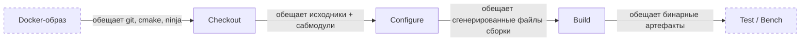

В прошлый раз я рассказал, зачем пишу игровой движок с нуля в 2026 году. С тех пор прошло две недели. Код не стал лучше. Но теперь у меня есть CI. По крайней мере, я так думал.

{/* truncate */}

## TL;DR

- CI-воркфлоу, написанный в конце июля, содержал матрицу из 15 конфигураций и делал ровно одну вещь: `actions/checkout`.
- Docker-образ для Sega Mega Drive не содержал git — checkout молча падал на сабмодулях и переключался на REST API.
- За две недели CI прошёл путь от заглушки до реальной сборки на четырёх платформах: Linux, macOS, Windows и Sega MD.
- Попутно: образы получили линтер, smoke-тесты и документированные переменные окружения.

## План спринта

- [x] Каркас сборочного воркфлоу (матрица платформ)
- [x] Починить Docker-образ MD (git, cmake, ninja)
- [x] Собрать движок на всех платформах
- [x] Push workflow для main
- [ ] Бенчмарки и тесты — плейсхолдеры готовы, самих шагов ещё нет

## Часть первая. Преступление

Всё началось в четверг вечером. Первый пост в блоге был опубликован. Сайт работал. Движок компилировался локально. Я открыл репозиторий, чтобы проверить CI — и обнаружил файл `build_cmake.yaml` на 122 строки.

Выглядело солидно. Матрица из 15 конфигураций: Windows MSVC x64 и x86, macOS Xcode и Ninja на arm64 и Intel, Linux Ninja x64 и arm64, плюс семь консольных платформ — MD, GBA, NDS, 3DS, Switch, GameCube, Wii. Контейнеры, таймауты, `secrets: inherit`. Красиво.

Беда была в том, что тело джобы состояло из одного шага: `actions/checkout`. Ни configure, ни build, ни test. Пятнадцать конфигураций делали checkout и уходили пить чай. CI, который ничего не собирает — забавный артефакт, но не очень полезный.

Я решил, что дописать configure и build — дело получаса.

Я ошибался на две недели.

## Часть вторая. Расследование

### Ложный след №1: «просто добавлю шаги»

Первая мысль была очевидной: добавить `cmake --preset` и `cmake --build --preset` в тело джобы. Пресеты уже были в `CMakePresets.json`, генератор Ninja — тоже. Что могло пойти не так?

Я запушил правку. CI упал. Не на configure и не на build — на checkout.

Лог был странный. `actions/checkout` писал: «The repository will be downloaded using the GitHub REST API. Input 'submodules' not supported when falling back to download using the GitHub REST API.» Оказалось, Docker-образ `toygine2.md.toolchain` не содержал git. Вообще. Checkout, не найдя git в контейнере, молча переключился на скачивание tarball'а через REST API — а тот не умеет сабмодули.

Почему checkout молчит о проблеме

`actions/checkout` проверяет наличие git в PATH. Если git не найден — не падает, не предупреждает, а тихо меняет стратегию. Tarball через REST API быстрее и не требует git, но ломается на `submodules: recursive`. Именно это и произошло.

Поведение документировано, но кто читает документацию к checkout, пока он не сломается?

### Ложный след №2: «поставлю git в образ»

Я открыл `Dockerfile.md` и добавил git в финальную стадию. Заодно проверил потребителя — репозиторий движка. И обнаружил, что одного git мало.

Во-первых, все пресеты движка собираются генератором Ninja. В образе не было `ninja-build`. Во-вторых, `cmake_minimum_required` требовал 3.27, а `bookworm/main` нёс 3.25.1. Если бы checkout не упал первым — упал бы configure. А если бы configure каким-то чудом прошёл — упал бы build.

Пакеты добавились: `ninja-build`, `git`, `ca-certificates`, `cmake` из `bookworm-backports`. Но пока я разбирался с образами, появился третий ложный след.

### Ложный след №3: «запиню версии и залинтю»

Hadolint — линтер Dockerfile'ов — настаивал на двух вещах: пинить все apt-пакеты как `pkg=version` (правило DL3008) и использовать `WORKDIR` вместо `cd` (DL3003). Оба требования казались разумными.

Я проверил. В Debian `main` лежит только текущая версия пакета. После выхода security-обновления строка `git=1:2.39.5-0+deb12u3` перестанет резолвиться и уронит сборку. Причём уронит **все** джобы разом, включая те, что не имеют отношения к пакетам.

Решение: `.hadolint.yaml` с явным списком игнорируемых правил и обоснованием рядом с каждым. Линтер выходит чистым, но не диктует политику, которая ломает воспроизводимость.

### Ложный след №4: ревью-бот

Параллельно основной работе ревью-бот присылал замечания. Некоторые были полезны. Другие — нет. Полезные я правил и шёл дальше. Вредные — проверял, и каждый раз обнаруживал что-то интересное.

**«`ubuntu-26.04` не существует, откатите на 24.04».** CI на `ubuntu-26.04` был зелёный. `gh api .../actions/runners` подтвердил: self-hosted раннеров нет, ubuntu-26.04 — реальный labelset GitHub Actions, просто документация отстала. Тот же бот молчал про `macos-26` и `windows-2025`.

**«`cancel-in-progress: false` — новый push отменит идущий деплой».** Формально верно. Но сборки с веток должны гаснуть, когда ветка ушла вперёд, а публикация на GitHub Pages защищена отдельной группой. С `false` очередь забили бы устаревшие сборки.

**«Уберите `-DBENCHMARKS_OUTPUT_FILE`, его никто не читает».** И правда: в репозитории нет ни одного `CMakeLists.txt`, который бы потреблял эту переменную. Но это не баг — это плейсхолдер. В CI четыре таких плейсхолдера: `run_benchmarks`, `bencher_testbed`, `run_test`, `BENCHMARKS_OUTPUT_FILE`. Вырезать один — сделать файл менее консистентным. Они ждут своего часа вместе с первым бенчмарком.

**«`secrets: inherit` раздаёт все секреты ни за чем».** Вот тут бот попал в точку — но не до конца. `pull_request.yaml` вызывал `build_cmake.yaml` с `secrets: inherit`, хотя callee не объявлял ни одного секрета и содержал один шаг checkout. Inherit действовал как сквозной коридор из PR-воркфлоу в reusable workflow — раздавал токены, которые никто не собирался использовать. Правку я отложил: тело джобы наполнялось шагами configure и build, и скоро там появятся секреты, которым этот коридор пригодится. Но сам факт повесил в воздухе вопрос: а что ещё в моих воркфлоу живёт своей жизнью, пока никто не смотрит?

## Часть третья. Эврика

На четвёртый день расследования я понял: я чиню не баги, а контракты.

CI — это не набор скриптов. Это цепочка обещаний, которые компоненты дают друг другу:

Каждая находка последних дней была не изолированным багом, а нарушением одного из этих контрактов. Git в образе — контракт образа с checkout. Ninja и cmake — контракт образа с configure. `permissions: pull-requests: write` в `build_cmake.yaml` — контракт, который никто не собирался исполнять. `secrets: inherit` в `push.yaml` — контракт, который раздаёт все секреты репозитория ни за чем.

Самое коварное — то, как эти нарушения проявляются. Ни одно не ломает CI громко и сразу. Checkout молча переходит на REST API. CMake печатает «Manually-specified variables were not used by the project» и идёт дальше. Неиспользуемые permissions не вызывают ошибок. Тихие баги. Ждут идеального момента.

Мисс Марпл замечает, что в деревне что-то не так, даже когда все улыбаются и пьют чай. Оказалось, для CI это тоже работает.

## Часть четвёртая. Развязка

К концу спринта `build_cmake.yaml` прошёл путь от заглушки до работающей сборки:

- **Linux** (x64 и arm64) — GCC 16 через `eatmydata` с APT-кэшем.
- **macOS** (arm64 и Intel) — Xcode с каскадным выбором версии.
- **Windows** (x64 и x86) — MSVC через `vswhere`.
- **Sega Mega Drive** — в контейнере `toygine2.md.toolchain`.

Добавлен `push.yaml` — отдельный воркфлоу, который запускается при push в main. В отличие от `pull_request.yaml`, ему не нужны права на комментарии в PR — только `contents: read` и `packages: read`. Но `secrets: inherit` оставлен: в матрице уже маячат `run_benchmarks` и `bencher_testbed`, и токен Bencher почти наверняка поедет именно этим путём. Пока это коридор в никуда — но коридор с табличкой «скоро открытие». Появился `.hadolint.yaml` — линтер Dockerfile'ов выходит чистым. В GBA-образе появился smoke-тест: `mgba-headless --version placeholder.gba` — бинарь проверяется в том же слое, где собирается.

{/*
IMAGE PLACEHOLDER 01: скриншот зелёного CI с матрицей из 4 платформ — список джоб в GitHub Actions
FOR AI: clean GitHub Actions UI screenshot showing a green build matrix across 4 platforms, dark theme, editorial tech blog style
*/}

## Что пошло не так

- **Деплой сайта пересобирает Doxygen на каждый push.** Правка поста в блоге запускает чекаут движка с сабмодулями, установку Doxygen 1.17, cmake configure и build таргета `docs`. HTML и dot-графы генерируются впустую. Планирую оверрайд флагов ради скорости.
- **Пять devkitPro-образов не имеют smoke-тестов.** Они состоят из `FROM` + `LABEL` — тулчейн из апстрима никем не проверяется.
- **Тело `build_cmake.yaml` всё ещё без шагов тестирования.** Четыре плейсхолдера в матрице ждут первого бенчмарка.

{/*
IMAGE PLACEHOLDER 02: скриншот лога CI с шагами checkout → configure → build → success, видно тайминги каждого шага
FOR AI: terminal screenshot of a successful CI job log showing the checkout, CMake configure, and Ninja build steps with timing, dark background, clean monospace font
*/}

## Бенчмарки (пока нет)

| Что | Было | Стало |
|-----|------|-------|
| Платформ в CI | 0 (только локально) | 4 (Linux, macOS, Windows, MD) |
| Шагов сборки | 1 (checkout) | 4 (checkout → prep → configure → build) |
| Docker-образов с линтером | 0 | 7 |
| Smoke-тестов в образах | 0 | 1 (GBA) |

Настоящая таблица «было/стало» появится, когда заработает Bencher.dev и первый бенчмарк. Пока ловлю низко висящие фрукты: время configure и build на каждой платформе.

## Планы на следующие две недели

- Bencher.dev: зарегистрировать проект, добавить `BENCHER_API_TOKEN`, настроить пороги.
- Self-hosted runner на Linux mini-PC для стабильных таймингов бенчмарков.
- Перенести заметки из Obsidian vault (`decisions/`, `structure/`, `context/`) в docs сайта.
- Smoke-тесты для остальных Docker-образов (NDS, 3DS, Switch).

## Вопрос к сообществу

Знаете, есть одна вещь, которая меня беспокоит. Когда CI молча падает — как checkout без git, который не падает, а меняет стратегию — это понятно. Страшно, но хотя бы воспроизводимо.

Но есть и обратная сторона. `secrets: inherit` в воркфлоу, который не использует секреты. `permissions`, которые никто не запрашивал. `-DBENCHMARKS_OUTPUT_FILE`, который никто не читает. Всё это — мёртвый код, только на уровне инфраструктуры.

И вот что мне интересно: как вы с этим справляетесь? У вас есть линтер для CI-воркфлоу, который ловит неиспользуемые переменные и permissions? Или это просто «заметил — поправил» по наитию? Поделитесь подходом — мне до первых бенчмарков ещё недели две, как раз хватит времени навести порядок.
