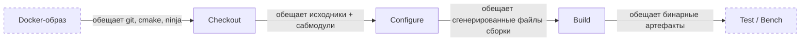

В прошлый раз я рассказал, зачем пишу игровой движок с нуля в 2026 году. Прошло две недели. Код лучше не стал. Но теперь у меня есть CI. По крайней мере, я так думал.

<!-- truncate -->

## TL;DR

- В конце июля появился CI-воркфлоу с матрицей из 15 конфигураций. Он делал ровно одну вещь: `actions/checkout`.
- Docker-образ для Sega Mega Drive не содержал git. Checkout переключился на REST API, написал об этом одну строку и поехал дальше. Сабмодули сломались. Никто не закричал.
- За две недели пайплайн прошёл путь от заглушки до сборки на четырёх платформах: Linux, macOS, Windows и Sega MD.
- Побочные эффекты: образы получили линтер, smoke-тесты и документированные переменные окружения.

## План спринта

- [x] Каркас сборочного воркфлоу (матрица платформ)
- [x] Починить Docker-образ MD (git, cmake, ninja)
- [x] Собрать движок на всех платформах
- [x] Push-воркфлоу для main
- [ ] Бенчмарки и тесты: плейсхолдеры на месте, шагов пока нет

## Часть первая. Преступление

Был четверг, вечер. Первый пост в блоге опубликован. Сайт работает. Движок компилируется локально. Я открыл репозиторий проверить CI и обнаружил файл `build_cmake.yaml`. Сто двадцать две строки.

Выглядело внушительно. Матрица из 15 конфигураций. Windows MSVC x64 и x86. macOS Xcode и Ninja на arm64 и Intel. Linux Ninja x64 и arm64. Семь консольных платформ сверху: MD, GBA, NDS, 3DS, Switch, GameCube, Wii. Контейнеры, таймауты, `secrets: inherit`. Красиво.

Одна проблема. Тело джобы состояло из одного шага: `actions/checkout`. Ни configure, ни build, ни test. Пятнадцать конфигураций забирали код и уходили домой. CI, который ничего не собирает, — забавный артефакт. Но не очень полезный.

Я прикинул: добавить configure и build — полчаса работы.

Ошибся на две недели.

## Часть вторая. Расследование

### Ложный след № 1: «просто добавлю шаги»

Первая мысль была очевидной. Добавить `cmake --preset` и `cmake --build --preset` в тело джобы. Пресеты уже лежали в `CMakePresets.json`. Генератор Ninja уже стоял. Что могло пойти не так?

Я запушил правку. CI упал. Не на configure. Не на build. На checkout.

Лог был странный. `actions/checkout` писал: «The repository will be downloaded using the GitHub REST API. Input 'submodules' not supported when falling back to download using the GitHub REST API.» Docker-образ `toygine2.md.toolchain` не содержал git. Вообще. Checkout, не найдя git в контейнере, переключился на скачивание tarball'а через REST API. Tarball'ы не умеют сабмодули.

Почему checkout не останавливается

`actions/checkout` проверяет наличие git в PATH. Если git не найден — не падает. Не предупреждает. Пишет одну информационную строку про REST API и меняет стратегию. Метод с tarball'ом через REST API быстрее и не требует git. Но ломается на `submodules: recursive`. Что и произошло.

Поведение задокументировано. Но кто читает документацию к checkout, пока он не сломался?

### Ложный след № 2: «поставлю git в образ»

Я открыл `Dockerfile.md` и добавил git в финальную стадию. Потом проверил потребителя — репозиторий движка. Одного инструмента не хватило.

Во-первых, все пресеты движка собираются генератором Ninja. В образе не было `ninja-build`. Во-вторых, `cmake_minimum_required` требовал 3.27, а `bookworm/main` поставлял 3.25.1. Не упади checkout первым — упал бы configure. Пройди configure каким-то чудом — упал бы build.

Пакеты добавились: `ninja-build`, `git`, `ca-certificates`, `cmake` из `bookworm-backports`. Но пока я латал образ, появился третий ложный след.

### Ложный след № 3: «запиню версии и залинтю»

Hadolint, линтер Dockerfile'ов, настаивал на двух вещах. Пинить все apt-пакеты как `pkg=version` (правило DL3008). Использовать `WORKDIR` вместо `cd` (DL3003). И то и другое звучало здраво.

Я проверил. Debian `main` держит только текущую версию каждого пакета. После security-обновления строка `git=1:2.39.5-0+deb12u3` перестаёт резолвиться. Сборка падает. Не одна джоба. Все джобы, включая те, что никак не связаны с изменившимся пакетом.

Решением стал `.hadolint.yaml` с игнорируемыми правилами и обоснованием рядом с каждым. Линтер выходит чистым. Но не диктует политику, которая ломает воспроизводимость.

### Ложный след № 4: ревью-бот

Пока всё это происходило, ревью-бот слал замечания. Одни были полезными. Другие — нет. Полезные я исправлял и шёл дальше. Остальные проверял — и каждая проверка вскрывала что-то интересное.

**«`ubuntu-26.04` не существует. Откатитесь на 24.04.»** CI на `ubuntu-26.04` был зелёный. `gh api .../actions/runners` подтвердил ноль self-hosted раннеров. `ubuntu-26.04` — реальный labelset GitHub Actions. Документация отстала. Тот же бот промолчал про `macos-26` и `windows-2025`.

**«Поставьте `cancel-in-progress: false`, иначе новый push отменит активный деплой.»** Наполовину верно. `true` отменяет ран, который уже выполняется в той же concurrency-группе; `false` не отменяет ничего — раны просто встают в очередь. Но сборки с веток должны гаснуть, когда ветка уходит вперёд, а деплой на GitHub Pages и так сериализован собственной группой на уровне джобы с `cancel-in-progress: false`. Смена флага на уровне воркфлоу лишь копила бы устаревшие сборки веток.

**«Уберите `-DBENCHMARKS_OUTPUT_FILE`. Его никто не читает.»** Тоже правда. Ни один `CMakeLists.txt` в репозитории не потребляет эту переменную. Но это не баг. Это плейсхолдер. В CI их четыре: `run_benchmarks`, `bencher_testbed`, `run_test`, `BENCHMARKS_OUTPUT_FILE`. Убрать один — сделать файл менее цельным. Все они ждут первого бенчмарка.

**«`secrets: inherit` раздаёт все секреты просто так.»** Тут бот был прав, но не до конца. `pull_request.yaml` вызывал `build_cmake.yaml` с `secrets: inherit`, хотя вызываемый воркфлоу не объявлял ни одного секрета и содержал единственный шаг checkout. Inherit работал как сквозной коридор из PR-воркфлоу в переиспользуемый — раздавал токены, которые никто не собирался тратить. Я отложил правку. Тело джобы наполнялось шагами configure и build. Скоро там появятся секреты, которым этот коридор пригодится. Но вопрос повис в воздухе. Что ещё в моих воркфлоу живёт своей жизнью, пока никто не смотрит?

## Часть третья. Эврика

На четвёртый день я понял. Я чинил не баги. Я чинил контракты.

CI — не куча скриптов. Это цепочка обещаний, которые компоненты дают друг другу:

Каждая находка этих дней была не отдельным багом, а нарушенным контрактом. Git в образе — контракт образа с checkout. Ninja и cmake — контракт образа с configure. `permissions: pull-requests: write` в `build_cmake.yaml` — контракт, который никто не собирался исполнять. `secrets: inherit` в `push.yaml` — контракт, раздающий все секреты репозитория без единой причины.

Самое неприятное — как эти нарушения проявляются. Ни одно не ломает CI громко. Checkout переключается на REST API и сообщает об этом как о мелочи. CMake печатает «Manually-specified variables were not used by the project» и идёт дальше. Неиспользуемые permissions не вызывают ошибок. Тихие баги. Ждут своего часа.

Мисс Марпл замечает, когда в деревне что-то не так, — даже если все улыбаются и пьют чай. Оказалось, с CI это тоже работает.

## Часть четвёртая. Развязка

К концу спринта `build_cmake.yaml` прошёл путь от заглушки до рабочего пайплайна.

- **Linux** (x64 и arm64). GCC 16 через `eatmydata` с APT-кэшем.
- **macOS** (arm64 и Intel). Xcode с каскадным выбором версии.
- **Windows** (x64 и x86). MSVC через `vswhere`.
- **Sega Mega Drive**. Внутри контейнера `toygine2.md.toolchain`.

Воркфлоу `push.yaml` теперь собирает движок при каждом push в main. В отличие от `pull_request.yaml`, ему не нужны права на комментарии в PR — только `contents: read` и `packages: read`. Но `secrets: inherit` остаётся. В матрице уже есть `run_benchmarks` и `bencher_testbed`, и токен Bencher почти наверняка поедет этим путём. Пока это коридор в никуда — но коридор с табличкой «скоро открытие». `.hadolint.yaml` держит линтер Dockerfile'ов чистым. GBA-образ получил smoke-тест: `mgba-headless --version placeholder.gba`. Бинарь проверяется в том же слое, где собрался.

## Что пошло не так

- **Деплой сайта пересобирает Doxygen при каждом push.** Правка поста в блоге запускает чекаут движка с сабмодулями, установку Doxygen 1.17, cmake configure и сборку таргета `docs`. HTML и dot-графы генерируются и выбрасываются. Нужен оверрайд флагов для скорости.
- **У пяти devkitPro-образов нет smoke-тестов.** Они состоят из `FROM` плюс `LABEL`. Тулчейн из апстрима никто не проверяет.
- **Тело `build_cmake.yaml` до сих пор без шагов тестирования.** Четыре плейсхолдера в матрице ждут первого бенчмарка.

## Бенчмарки (пока нет)

| Что                    | Было                | Стало                                |
| ---------------------- | ------------------- | ------------------------------------ |
| Платформ в CI          | 0 (только локально) | 4 (Linux, macOS, Windows, MD)        |
| Шагов сборки           | 1 (checkout)        | 4 (checkout, prep, configure, build) |
| Образов с линтером     | 0                   | 7                                    |
| Smoke-тестов в образах | 0                   | 1 (GBA)                              |

Настоящая таблица «было/стало» появится, когда заработает Bencher.dev с первым бенчмарком. Пока снимаю самое очевидное: время configure и build на каждой платформе.

## Планы на следующие две недели

- Bencher.dev: зарегистрировать проект, добавить `BENCHER_API_TOKEN`, настроить пороги.
- Self-hosted runner на Linux mini-PC для стабильных таймингов бенчмарков.
- Перенести заметки из Obsidian-вольта (`decisions/`, `structure/`, `context/`) в docs сайта.
- Smoke-тесты для остальных Docker-образов (NDS, 3DS, Switch).

## Вопрос к сообществу

Есть одна вещь, которая меня беспокоит. Когда CI ломается тихо — как checkout без git, который не роняет сборку, а меняет стратегию, — это я понимаю. Страшновато, но хотя бы воспроизводимо.

Обратная сторона тревожит сильнее. `secrets: inherit` в воркфлоу, который не использует секреты. `permissions`, которые никто не просил. `-DBENCHMARKS_OUTPUT_FILE`, который никто не читает. Мёртвый код на уровне инфраструктуры.

Как вы с этим справляетесь? Есть ли у вас линтер для CI-воркфлоу, который ловит неиспользуемые переменные и permissions? Или только «заметил — поправил» по наитию? Поделитесь подходом. У меня около двух недель до первых бенчмарков — как раз хватит времени навести порядок.
