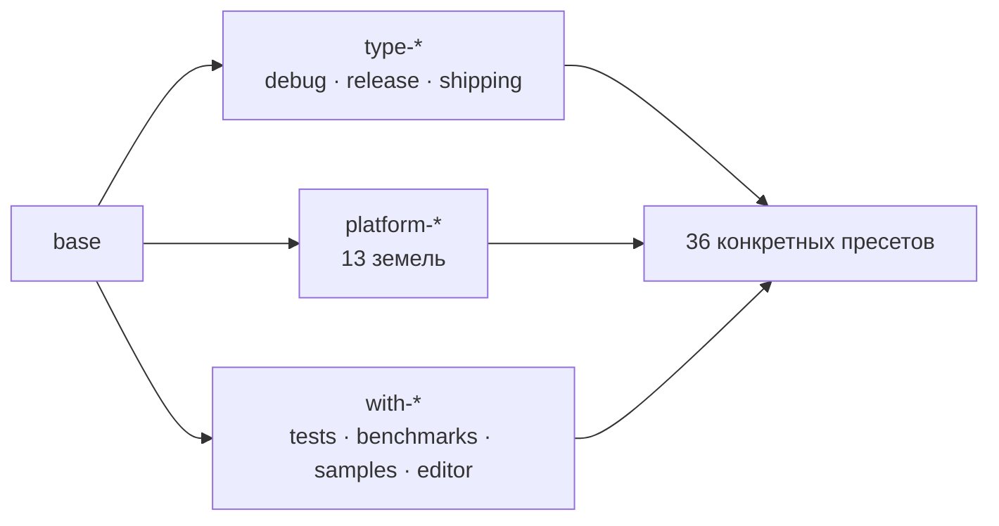

ToyGine2 — движок для ретро-консолей. Поселение стоит на перекрёстке тринадцати земель: от Game Boy Advance и Mega Drive до Windows, macOS и Linux. В тот цикл у него ещё не было ни одной дороги, по которой чужой корабль дошёл бы до причала сам.

<!-- truncate -->

## Что случилось

В этот приливной цикл я разметил карту архипелага по трём осям, поставил над свитками стража, который больше не молчит, и открыл гавань семи чужим кораблям. Духов было столько, что я перестал считать их к середине цикла: один притворялся землёй Nintendo 64, другой подменял груз и оставлял печать целой, третий не пускал гонца к собственному очагу. К концу цикла табличка была вырезана и отнесена в дом знания — [вот полка, на которой она лежит](https://github.com/ToymanInteractive/toygine2/releases/tag/26.16.0).

**План цикла:**

- Разметить пресеты сборки по осям: тип, платформа, набор компонентов
- Сделать сборку документации гейтом, а не отчётом
- Довести Docker-образы до состояния, в котором CI на них запускается
- Собрать скелет матричной сборки под все целевые платформы

## Карта в трёх осях

Прежде карты не было вовсе. Чтобы собрать поселение под другую землю, я держал порядок слов в голове и каждый раз вспоминал его заново, и вспоминал не всегда верно.

Я разложил дороги по трём осям. Первая — каков дом внутри: `type-debug`, `type-release`, `type-shipping`. Вторая — на какой земле он стоит: тринадцать `platform-*`, от Windows на двух архитектурах до Mega Drive, Nintendo 64 и Wii. Третья — что в нём есть кроме стен: `with-tests`, `with-benchmarks`, `with-samples`, `with-editor`. На пересечении осей встали тридцать шесть конкретных пресетов.

Карта не заработала. `cmake --list-presets` не выводил ничего — падал целиком с жалобой, что версия файла должна быть третьей или выше. Восемь пресетов уже несли `toolchainFile`, а в шапке стояла единица: я нанёс на карту дороги, о которых сам её формат не знал.

Это оказалось мелочью. Дух сидел глубже, и три дня я его не видел.

Пресеты наследуются, и я был уверен, что при конфликте побеждает более поздний предок — так устроено почти везде, где я встречал наследование. CMake разрешает конфликт в пользу **более раннего**. Общий предок `base` стоял в списке первым у всех тридцати шести пресетов и молча перебивал всё, что шло после него: `TOYGINE_BUILD_*` оставались `OFF` вопреки объявленному `with-tests`, а генератором везде оказывался Ninja — при том, что `macos-xcode` заявлял Xcode, а Windows-пресеты Visual Studio.

Хуже другое. Я успел вывести из этого целую теорию — «MSVC и Xcode многоконфигурационные, поэтому `CMAKE_BUILD_TYPE` там игнорируется» — и она была верна по существу, но опиралась на генератор, который был *объявлен*, а не на тот, который получался. А таблицу эффективных переменных кэша я считал скриптом собственного сочинения, и приоритет в нём стоял обратный. Я проверял ошибку той же самой ошибкой.

Ритуал был короче диагноза. `base` переехал в конец `inherits` у всех тридцати шести пресетов, версия файла поднялась до третьей, `cmake_minimum_required` — с 3.19 до 3.27. Появились три shipping-пресета: до них MSVC и Xcode нельзя было сконфигурировать без редактора, тестов, сэмплов и бенчмарков разом. Появились тридцать шесть видимых build-пресетов — их отсутствие уже успело уронить CI, потому что `cmake --list-presets=build` не выводил ничего, шаг сборки документации упал с `No such build preset: "linux-debug"`, и шаг тогда просто удалили.

Проверял я на этот раз живыми прогонами, а не рассуждением. `macos-release`: `TOYGINE_BUILD_*` из `OFF` стали `ON`. `macos-xcode`: генератор из Ninja стал Xcode, и на диске появился настоящий `ToyGine2.xcodeproj`. `gba-release`: кросс-таргет не задет. С тех пор эффективные значения я смотрю в `CMakeCache.txt` — в том, что получилось, а не в том, что написано.

Последний дух этой темы был самым тихим. `cmake --preset n64-debug` завершался успехом. Ветка Nintendo 64 в `ConfigureCompiler.cmake` была пуста, `platform-n64` — единственный ретро-таргет без `toolchainFile`, и сборка спокойно шла системным `/usr/bin/c++`. Поселение стояло на песке и уверяло, что стоит на камне. Теперь пустая ветка обрывается `FATAL_ERROR`, и `n64-debug` честно возвращает единицу.

Житель поселения ничего этого не видит. Он набирает `cmake --preset macos-release` — одну строку. Про порядок предков ему знать незачем, и в этом весь смысл: карту чертят, чтобы её потом не читали.

## Страж над свитками

Свитки в поселении писались давно, а читал их придирчиво только я сам. Doxygen отвечал «всё хорошо» при любом числе жалоб: `WARN_AS_ERROR` стоял в `NO`, а `WARN_LOGFILE` уводил жалобы в файл, куда никто не заглядывал. Битый `\param` давал нулевой код возврата и пустую консоль.

Я поставил стража: `WARN_AS_ERROR = FAIL_ON_WARNINGS_PRINT`. Не `YES` — тот останавливается на первом же предупреждении, и разбирать их пришлось бы по одному за прогон. `FAIL_ON_WARNINGS_PRINT` печатает весь список сразу и только потом падает.

Страж заговорил — и CI упал в тот же день: `clang: Failed to parse translation unit` на двух файлах. Первая мысль была очевидной и неверной: новая строгость сломала сборку. Сломала она только тишину. Те же ошибки лежали там и раньше — просто при `WARN_AS_ERROR = NO` они не меняли код возврата. Виновником оказался `CLANG_ASSISTED_PARSING`: он работает только в CI, потому что официальный бинарник Doxygen собран с libclang, а мой — нет. Опцию, поведение которой зависит от того, чьими руками собран инструмент, я выключил.

Второй дух жил в гонце, а не в свитках. Тарбол Doxygen скачивался обычным `curl` без `--fail`. На ответе 404 или 500 `curl` возвращает ноль и покорно пишет тело страницы ошибки в `doxygen.tar.gz`. Проверка `|| { echo "Failed to download Doxygen"; exit 1; }` не срабатывала ни разу за всё время — гонец приносил не тот груз, но с целой печатью, и падение вылезало шагом позже невнятным `tar: not in gzip format`.

Остальное в этой теме — мелкая кладка. `Doxyfile` стал генерироваться в каталог сборки, а не в исходники: раньше два пресета дрались за один файл. `DOT_PATH` уехал в кавычки — на Windows в пути бывают пробелы. `MERMAID_RENDER_MODE` переключился с `AUTO` на `CLI`: Doxygen вставлял `import mermaid` с jsDelivr в каждую страницу сайта при ровно нуле диаграмм в репозитории. Сам воркфлоу переехал с `push` на `pull_request` и перестал плодить черновые релизы из каждой ветки.

Со стороны всё это выглядит как сайт документации, который просто есть. Молчащий оберег и работающий выглядят одинаково — ровно до того дня, когда мимо проходит дух.

## Гавань и чужие корабли

Семь консольных тулчейнов живут у меня в контейнерах, и шесть из них построены на образе devkitPro — то есть чужими руками и давно. Седьмой, для Mega Drive, я собирал сам на голом `debian:bookworm-slim`. Он же единственный оказался с собственным пользователем внутри, и с него всё началось.

Раннер монтирует свой рабочий каталог внутрь контейнера и создаёт там служебные файлы от своего имени — с правами `0755` и от пользователя с идентификатором 1001. Контейнер он при этом запускает без указания пользователя, и внутри работает мой `builder` с идентификатором 1000. Записать в чужой каталог builder не мог. Падал не запуск контейнера — падал `actions/checkout`, на попытке сохранить собственное состояние, с невнятным `EACCES`. Гонца не пустили к очагу в доме, который для него же и открыли. Директиву `USER` я снял.

Дальше выяснилось, что `actions/checkout` запускает `git` из самого образа, а в финальной стадии MD-образа никакого `git` не было. Без него checkout молча уходит за архивом через REST API — не жалуется, не предупреждает, просто идёт другой тропой. О подмене узнаёшь позже и с другой стороны: `Input 'submodules' not supported when falling back to download using the GitHub REST API`. Подмодули этим путём он выкачивать не умеет.

Ритуал занял один слой Dockerfile и полдня проверок. В финальный образ уехали `git`, `ca-certificates`, `curl`, `xz-utils`, `unzip` и `ninja-build` — последний потому, что все пресеты движка идут через Ninja. С `cmake` пришлось повозиться: в основном разделе Debian лежит 3.25.1, а движку нужен не ниже 3.27, поэтому cmake ставится отдельной строкой из backports и приезжает версией 3.31.6. Стадия сборки намеренно осталась на старом `cmake`: в ней собираются ассемблер и ClownLZSS, у которых в `cmake_minimum_required` стоят древние числа.

Два духа в том же образе оказались уже не про сборку, а про вежливость к соседям. Первый — переменная `PREFIX=/opt/clownmdsdk`. В стадии сборки она была лишней: все четыре стадии ClownMDSDK выставляют её сами. В финальном образе она была опасной — образ монтирует чужой проект, а `PREFIX ?= /usr/local` в Makefile потребителя уважает окружение, и чей-нибудь `make install` уехал бы прямиком в каталог SDK. Переменная получила имя `CLOWNMDSDK`.

Второй дух этой пары — `LANG=en_US.UTF-8` в образе, где нет пакета `locales`. Я проверил внутри контейнера: `locale -a` знает только `C`, `C.utf8` и `POSIX`, а `LANG=en_US.UTF-8 locale charmap` отвечает тремя ошибками и откатом на `ANSI_X3.4-1968`. То есть UTF-8 не включался вовсе, а `makeinfo` при сборке binutils жаловался не зря. `C.UTF-8` живёт в самой glibc и стоит ноль байт.

А в образе для Game Boy Advance не хватало оберега. Стадия сборки собирала `mgba-headless` и копировала готовый бинарь в финальный образ, ни разу его не запустив. Так было с самого появления файла. Я добавил `mgba-headless --version placeholder.gba`. Аргумент здесь обязателен, и это не описка: проверка флага версии стоит в исходниках mGBA *после* отбраковки пустого имени файла, поэтому голый `--version` печатает справку и выходит с единицей. Файла `placeholder.gba` при этом нет и быть не должно — выход по ветке версии происходит раньше, чем эмулятор начнёт искать ядро. Прогон занимает 0,1 секунды и печатает версию вместе с хешем коммита; хеш совпадает с пином в Dockerfile, так что оберег заодно сторожит рассинхрон пина и слоя.

Житель поселения видит зелёную галочку. Он не знает ни про идентификаторы пользователей, ни про то, что `git` внутри образа — не тот `git`, которым он пользуется у себя. Гавань меряется тем, войдёт ли в неё чужой корабль, ни о чём тебя не спросив.

## Прочее за цикл

Правами на CI пришлось заняться отдельно. Верхний уровень вызывающего воркфлоу задаёт потолок: всё неперечисленное там неявно равно «ничего». Блок прав внутри переиспользуемого воркфлоу только объявляет требование и выдать сверх потолка не может.

Собрался скелет матричной сборки на пятнадцать конфигураций — пятнадцать берегов на тринадцати землях, потому что иные земли принимают по два корабля: Windows на двух архитектурах, macOS через Xcode и Ninja на arm64 и Intel, Linux на x64 и arm64, плюс семь консольных таргетов в контейнерах. Появился шаг подготовки раннера — `vswhere` и путь к `dumpbin` на Windows, каскад версий Xcode на macOS, `gcc-16` через `update-alternatives` на Ubuntu. Пакеты APT кэшируются, чтобы не тянуть их каждый прогон. Дата в теге образа стала считаться один раз: раньше её вычисляли дважды, и сборка, начатая перед полуночью UTC, могла получить вчерашний тег с сегодняшней меткой версии.

## Тупиковые тропы

Тропа через мангры: разделить сборку документации на две цели

Идея была хорошая: `docs-html` и `docs-xml` отдельными целями поверх одного шаблона. Я даже замерил выигрыш — XML-прогон 0,74 секунды против 1,38 у HTML. В коммит это не вошло: правку откатили, и правильно — сайту всё равно нужны оба формата, а точек синхронизации стало бы две.

Шепотки о печатях (ложный след)

Три раза подряд мне советовали закрепить действия CI по хешу коммита вместо тега. Разбирая совет, я нашёл занятное: у аннотированного тега двухшаговое разрешение, и наивная замена подставляет хеш объекта тега, а не коммита. Но сам совет целил не туда — предлагалось закреплять действия, написанные самим GitHub, тогда как сторонние оставались на тегах.

Земля, которой якобы нет

Дважды за цикл мне сообщали, что метка раннера `ubuntu-26.04` не существует и надо откатиться на 24.04. К тому моменту на этой метке лежали три успешных прогона подряд, а позже — двадцать зелёных джоб из двадцати. Незнакомое не значит несуществующее; это стоило проверять прогоном, что я и сделал.

Леса вокруг пустоты

В матрице сборки нашёлся аргумент `-DBENCHMARKS_OUTPUT_FILE`, который не читает ни один `CMakeLists.txt`. Шесть джоб честно печатали, что переменная не использована. Копнув, я обнаружил, что мертва не переменная, а вся затея: каталога `benchmarks/` в репозитории нет, как нет и шагов запуска. Четыре заготовки стоят в матрице и ждут дома, который ещё не построен. Я оставил их стоять.

## Здоровье рифа

| Что мерил                            | Было                       | Стало                    |
| ------------------------------------ | -------------------------- | ------------------------ |
| `cmake --list-presets`               | падает на версии файла     | 36 configure + 36 build  |
| `TOYGINE_BUILD_*` в `macos-release`  | `OFF` вопреки `with-tests` | `ON`                     |
| Генератор в `macos-xcode`            | Ninja                      | Xcode, проект создаётся  |
| `cmake --preset n64-debug` на хосте  | успех на `/usr/bin/c++`    | выход с кодом 1          |
| Битый `\param` в Doxygen             | код 0, пустая консоль      | падение с полным списком |
| Конфигураций в матрице сборки        | 0                          | 15                       |
| Smoke-тест mGBA в образе GBA         | нет                        | 0,1 секунды              |
| Ссылок на внешний CDN в документации | на каждой странице         | 0                        |

## Кохау

Табличка этого цикла вырезана и лежит в доме знания, как делали на Аотеароа. На ней записано немного: система сборки, приливной маяк над ней и тончайший из возможных редакторов — окно, которое открывается, и меню, в котором почти ничего нет. Для первой таблички этого достаточно; генеалогии на ней пока некому продолжать.

## Земли за горизонтом

Дальше я собирался достроить в матрице то, ради чего она затевалась: запуск тестов и бенчмарков, выгрузку измерений наружу, ROM-тесты для Game Boy Advance на настоящем эмуляторе. Хотелось довести до конца консольные приложения на NDS, 3DS и Switch — тулчейны для них уже стояли в гавани и ждали. И был отдельный замысел про часы: единый источник времени для всех платформ, от которого можно вести кадр.

Записываю это спустя годы и не берусь пересказывать, что из этого чем обернулось.

## Вопрос к общине

Больше половины духов этого цикла были одной породы: инструмент отвечал «всё хорошо» там, где хорошо не было. `curl` возвращал ноль на странице ошибки, Doxygen — ноль при полном логе жалоб, checkout молча менял тропу, пресет N64 собирался системным компилятором и не подавал виду. Каждый раз я узнавал об этом случайно и позже, чем следовало.

Вопрос к тем, кто строит сейчас: как вы ловите такое? Есть ли способ находить молчаливые успехи заранее — до того, как они вылезут в другом месте и под чужим именем? Я за все эти годы ничего лучше выборочной проверки руками не нашёл, но очень надеюсь, что ошибаюсь.
