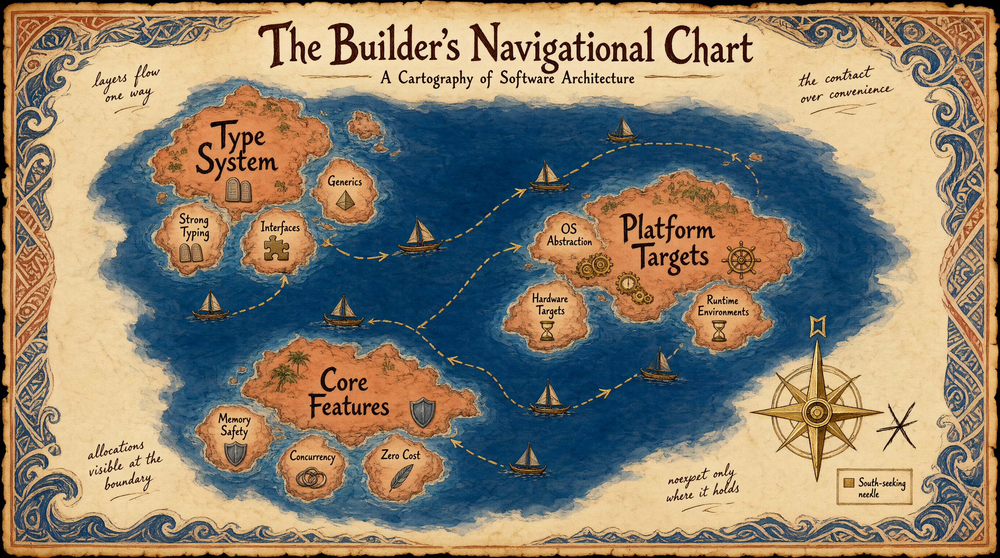

ToyGine2 — игровой движок для ретроконсолей. Поселение стоит
на перекрёстке пятнадцати платформ: от Game Boy Advance
до Steam Deck, от Windows до Nintendo 64. Строитель только
начинает разбирать руины.

<!-- truncate -->

## Что случилось

В этом приливном цикле Строитель переписал законы поселения
с чужого наречия на язык этой земли, расчертил карту архипелага
в трёх измерениях и наладил маяк, который теперь виден с любого
острова. Попутно три корабля получили имена и перестали тонуть
в гавани. Артефакт этого цикла оставлен в хранилище.

**План дня:**

- Переписать свод правил поселения
- Настроить карту сборок для всех платформ
- Починить падающую гавань

## Закон над водой

Старые законы были написаны для другой земли. Они ссылались
на технологию, которую в этом архипелаге никто не видел
вживую — малопригодную для игр, незнакомую с железом,
говорящую на чужом наречии. Правила стиля предписывали приёмы,
бессмысленные за пределами той земли. Правила тестирования —
ритуалы, которые здесь нечем исполнить. Поселение живёт
по другим законам, но свиток об этом молчал.

Строитель взялся за переписывание.

Первым делом — C++. Двадцать пять правил вместо дюжины: views
и spans, monadic error flow, deducing this, compile-time контракты.
Не перечисление возможностей нового стандарта, а живой свод:
что применять, когда и почему.

Затем — сам движок. Девятнадцать правил рантайм-архитектуры: как
течёт время внутри кадра, почему детерминизм это не свойство кода,
а дисциплина, как устроен component storage, что происходит
на границе рендера и симуляции. Правила, которые не сформулируешь,
пока не построишь хотя бы один дом.

Дальше — публичное API. Тринадцать правил: call-site first,
минимальная поверхность, сильные типы на границе, видимые аллокации
и ошибки. Контракт дороже удобства.

Архитектура движка: двенадцать правил статической структуры.
Односторонние слои — platform → core → сервисы → системы → gameplay →
tools. Ацикличный граф модулей. Движок как библиотека: без `main`,
без окна, без аргументов командной строки.

Тестирование, документация, error handling — каждая секция
переписывалась не переводом, а перестройкой с фундамента.

Правила не просто писались — они проверялись. Каждый тезис сверялся
с реальным устройством репозитория. Утверждение про `noexcept` прошло
три редакции, прежде чем совпасть с действительностью: исключения
выключены сборкой, но помечать `noexcept` стоит только то,
что действительно гарантирует отказ от бросков. Повторы вычищались:
один и тот же запрет на `reinterpret_cast`, описанный в пяти секциях,
свёрнут в ссылку. Перекрёстные ссылки аудировались скриптом: 152
цели, две битые.

К концу цикла свод законов перестал быть чужим. Он говорит о том,
что построено, а не о том, что хотелось бы построить.

## Карта архипелага

Тридцать шесть пресетов CMake. Три оси: `type-*` (debug, release,
shipping), `platform-*` (тринадцать таргетов от Windows x64
до Nintendo 64), `with-*` (тесты, бенчмарки, редактор, сэмплы).
Карта, покрывающая каждую точку архипелага.

Карта не работала.

`base` стоял первым в списке наследования у каждого пресета. CMake
разрешает конфликты в пользу более раннего — и `base`, объявлявший
генератор `Ninja` и все опции выключенными, молча перебивал всё,
что объявляли `platform-*` и `with-*`. Ни один пресет не собирал
тесты. Xcode-пресет генерировал не `.xcodeproj`, а Ninja-файлы.
Четыре сессии никто не замечал.

Дух сидел не в воде. Дух сидел в приоритете наследования.

Когда `base` был перенесён в конец `inherits` у всех тридцати шести
пресетов, карта ожила. `macos-xcode` стал генерировать настоящий
проект Xcode. `windows-msvc` — решения Visual Studio. Тесты, сэмплы
и бенчмарки включились там, где должны были.

Отдельно — Nintendo 64. Пресет `n64-debug` не имел `toolchainFile`
и молча собирался под системный `/usr/bin/c++`, притворяясь кросс-
компиляцией. Ветка в `ConfigureCompiler.cmake` получила `FATAL_ERROR`.
Теперь попытка собрать неподдерживаемый таргет падает громко, а не
притворяется успехом.

Урок, вынесенный из этого дня и закреплённый в свитке: проверять
конфигурацию по `CMakeCache.txt`, а не рассуждением. Дефект четыре
сессии не замечали именно потому, что сборка проходила успешно —
не туда, не с теми опциями, но успешно.

## Корабли в гавани

Семь Docker-образов — по одному на каждую консольную платформу.
Образ Sega Mega Drive был единственным, собранным на `debian:bookworm-slim`,
и первым, кто упал.

Первое падение: `EACCES`. GitHub Actions раннер бинд-маунтит
рабочую директорию от пользователя `runner` (uid 1001), а образ
переключался на `builder` (uid 1000) и терял доступ. Решение —
убрать `USER` из образа. Правило non-root исполнения, казавшееся
универсальным, разбилось о реальность job-контейнеров.

Второе падение: `git: not found`. `actions/checkout` запускает git
из образа, а в финальной стадии образа MD его не было. Без git
checkout молча уходит в tarball по REST API — и тот не умеет
подмодули.

Третье: нет `ninja-build`. Четвёртое: cmake из `bookworm/main`
(3.25.1) не дотягивает до минимальной версии 3.27. Оба нашлись
в `bookworm-backports`.

Пятое — самое тонкое: `ENV PREFIX=/opt/clownmdsdk`. Образ монтирует
чужой проект, а `PREFIX ?= /usr/local` в Makefile'ах потребителя
уважает окружение. Одна чужая переменная — и `make install` уезжает
в каталог SDK. Переменная вдобавок была не нужна: апстрим сам
экспортирует `PREFIX` при сборке, а потребитель хардкодит путь.
Решение: `CLOWNMDSDK` вместо `PREFIX`, правило в своде законов:
«`ENV` именуется по своему SDK, generic-имена запрещены».

Шестое: `LANG=en_US.UTF-8`, которого в `debian:bookworm-slim` нет.
`locale charmap` падает с ошибкой и откатывается на `ANSI_X3.4-1968` —
UTF-8 выключен, `makeinfo` шумит. Замена на `C.UTF-8` — ноль байт,
потому что живёт в самой glibc.

Образ Game Boy Advance получил smoke-test: `mgba-headless --version
placeholder.gba`. Аргумент-заглушка обязателен — mgba проверяет файл
до вывода версии, а без файла печатает usage и падает. Попутно тест
сверяет вшитый коммит mGBA с задекларированным в Dockerfile.

С маяком — свои заботы. Reusable workflow для CodeQL требовал прав
`security-events: write`, которых не было у вызывающего. Concurrency-
группы были настроены с разными ключами в трёх воркфлоу. `curl --fail`
отсутствовал, и HTTP 404 молча записывался в tar-архив. Doxygen-сборка
годами падала на clang-разборе и не замечалась, потому что
`WARN_AS_ERROR` стоял в `NO`.

К концу цикла гавань заработала. Матрица из пятнадцати конфигураций —
Windows, macOS, Linux, семь консолей в контейнерах — встала в строй.

## Тупиковые тропы

Тропа через мангры (non-root в Docker-образе)

Исходная посылка — «образы должны быть непривилегированными» —
разбилась о GitHub Actions. Хостовый раннер и контейнер живут
под разными uid, и checkout падает на `saveState`. Вариант
«выставить uid 1001» чинит GitHub-hosted раннеры и ломает всё
остальное. Вариант «чинить потребителей» перекладывает обязанность
на каждый workflow. Решение: образы не задают `USER` вообще.

Шепотки духов (ложные повторы в своде законов)

Три сессии подряд Строитель находил повторы в своде законов —
и трижды правки оставались неприменёнными. Повторы были намеренными:
каждая секция читается автономно, правило про `\ref` нужно и в разделе
про ссылки, и в шаблоне документации концепта. Только на четвёртой
сессии найден компромисс: уникальный остаток сохраняется, дубль
заменяется перекрёстной ссылкой.

Ложный след (SHA-пиннинг GitHub Actions)

Трижды за цикл предлагалось заменить теги действий на SHA. Трижды
предложение было отклонено: все действия в репозитории пиннятся
тегами, а SHA-пиннинг dependabot всё равно обновляет — вопрос
не безопасности, а административной политики. На третий раз
обнаружено, что `v4.36.2` — annotated tag, и его SHA указывает
на тег-объект, а не на коммит.

## Здоровье рифа

| Метрика                | Было            | Стало                         |
| ---------------------- | --------------- | ----------------------------- |
| Пресетов CMake         | 3 (одна ось)    | 36 (три оси)                  |
| Платформ в CI-матрице  | 0 (только docs) | 15                            |
| Docker-образов         | 7 (один сломан) | 7 (все работают)              |
| Правил в своде законов | ~40 (Dart)      | ~150 (C++23/game engine)      |
| Строк в своде          | ~900            | ~650 (после дедупликации)     |
| Doxygen: CI-гейт       | нет             | fail на первом предупреждении |

## Хроники

Артефакт цикла —
[релиз 26.16.0](https://github.com/ToymanInteractive/toygine2/releases/tag/26.16.0) —
оставлен в хранилище. Корабли в гавани поименованы, карта
архипелага расчерчена.

## Земли за горизонтом

Свод законов не дописан — секция за секцией правила всё ещё
переезжают, сворачиваются, аудируются. Битые ссылки тянутся
с первых дней. `CMakeLists.txt` с опцией
`TOYGINE_BUILD_BENCHMARKS` при отсутствующем каталоге `benchmarks/`.
Семь образов ждут версионных тегов вместо `:latest`.

За горизонтом — первые тесты, первый код за пределами `core`,
первый прогон на железе.

## Вопрос к общине

Строитель возвращается к костру и разворачивает карту. Тридцать
шесть пресетов, пятнадцать платформ — каждая со своим toolchain,
своим генератором, своим контейнером. Маяк виден, корабли на плаву.

«Те, кто строил свои поселения на перекрёстке платформ, — говорит
Строитель, — как вы справляетесь с матрицей сборок? Стоит ли держать
пресеты для каждой комбинации `type × platform × feature`, или лучше
собирать по слоям? И где у вас живёт Nintendo 64?»
