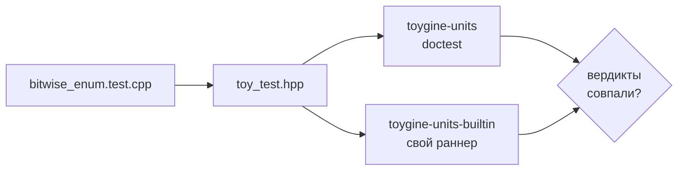

За две недели я снял с полки восемь приставок, по одной на пул-реквест. Я пишу движок ToyGine2 для небольших игр, которые должны запускаться и на современных машинах, и на приставках с этой полки. В этом цикле у движка появился свой раннер тестов, а у каждой из восьми приставок — собранный в CI образ.

<!-- truncate -->

[Коротко](#short) · [Свой раннер тестов](#runner) · [Тесты доезжают до GBA](#gba) · [Сэмпл на восьми приставках](#samples) · [Цифры](#numbers) · [Что дальше](#next)

## Коротко {#short}

Движок получил собственный раннер тестов. Он собирается там, где doctest не может, и выносит тот же вердикт. На десктопе тесты собираются под обоими раннерами сразу, а на GBA тестовый ROM гоняется в CI под mGBA. Консольный сэмпл собирается на восьми приставках, и для каждой в пул-реквесте лежит свой образ. Всё это вошло в версию 26.18.0: [релиз на GitHub](https://github.com/ToymanInteractive/toygine2/releases/tag/26.18.0).

- Артефакты закрытого пул-реквеста удаляются сразу, а не через семь дней хранения. Имя ветки вида `main&event=push` больше не подменяет параметры запроса к API.
- Появился Docker-образ тулчейна Wii U. CI теперь сверяет тег базового образа в `FROM` с меткой образа: Dependabot поднял тег в `Dockerfile.gba`, а метку не тронул.
- Wii U не появлялась в списке платформ: модуль поиска отдавал `DEVKITPRO_WIIU_FOUND`, а проверка ждала `DEVKITPRO_WII_U_FOUND`.
- Почти каждый пул-реквест приносил по флагу MSVC: `/GF`, `/GL`, `/GR-`, `/GS`, `/guard:cf`, `/Gw`, `/Gy`, `/RTC1` и ещё несколько.
- В CI стоит clang-format 23, и он больше не выносит «свой» заголовок над стандартными.
- Скрипт в CI ловит тесты модулей, которые лезут во внутренности раннера.

## Свой раннер тестов {#runner}

На десктопе модульные тесты движка гоняет doctest. На приставках тестового бинаря не было совсем: тестовые файлы под их тулчейнами даже не компилировались, и `static_assert` в них молчали.

Сначала я проверил, нельзя ли обойтись doctest. Под devkitARM для GBA и 3DS он собрался и слинковался в ROM. Под ClownMDSDK для Mega Drive не собрался: это freestanding-окружение, без `<signal.h>`, `<ctime>` и прочего, на что doctest рассчитывает. Формально свой раннер был нужен одной Mega Drive, но я стал писать его для всех приставок. Иначе каждое изменение в тестах начиналось бы с вопроса, какой раннер стоит на какой платформе. Ограничения задала самая узкая цель: ни одной аллокации в куче и из стандартной библиотеки только шесть заголовков, которые есть в ClownMDSDK.

Главное правило раннера — один и тот же тест даёт одинаковый вердикт под doctest и под своим раннером. На этом правиле я споткнулся почти сразу. Сравнение с допуском `Approx` я написал по памяти, и ревью нашло расхождение с исходником doctest 2.5.3:

```cpp
// было
difference <= epsilon * max(1.0, larger)
// стало, дословно как в doctest
difference < epsilon * (1 + larger)
```

Формулы похожи, но около единицы при разнице в полтора эпсилона doctest говорит «равно», а моя говорила «нет». Ни один существующий тест вердикт не поменял, так что расхождение дожило бы до первого теста у самого порога. Теперь формулу сторожит проверка на этапе компиляции.

Ревью предлагало и другое: считать всё в `double`, как doctest. Это я отклонил после замера. У Mega Drive процессор 68000 без FPU, и одно сравнение двух `float` выросло бы со 168 до 248 байт кода. Платила бы ровно та приставка, ради которой раннер и писался, поэтому узкое расхождение в точности я не устранил, а описал в документации.

Чтобы правило не держалось на честном слове, на десктопе один и тот же набор тестов собирается дважды: целью `toygine-units` под doctest и целью `toygine-units-builtin` под своим раннером. На первом переведённом файле встроенный раннер отчитался `1..7` и `passed=18`, doctest — `test cases: 7 | assertions: 18`. Подмена `0xFF` на `0xFE` в одной проверке уронила обе цели. Так проверяют новую шестерню взамен старой: насаживают обе на одну ось и смотрят, совпадают ли зубья.



<details>
<summary>Тест субкейсов, который дважды проходил с багом</summary>

Кейс `each_subcase_runs_exactly_once` проверяет, что раннер заходит в каждый субкейс ровно один раз. Я переписывал его трижды. Первая форма держалась на глобальных счётчиках, а две следующие проходили с подсаженным багом. Вторая сверяла счётчики контекста, и раннер, который на всех прогонах входил в первый субкейс, давал те же цифры. Третья запоминала за прогон только последнее имя субкейса, и прогон, зашедший в первый и во второй субкейс, выглядел как зашедший только во второй. Сработала четвёртая: на каждый прогон заводится запись с именем и счётчиком входов.

</details>

Зелёный прогон ничего не говорит о том, ловит ли тест хоть что-то. Тесты раннера я теперь проверяю подсаженными багами до того, как считать работу законченной. Для того, кто пишет игру на движке, всё сводится к одной строке: тест подключает `toy_test.hpp` вместо doctest, и тот же файл идёт на десктопе и на приставке с одинаковым вердиктом.


## Тесты доезжают до GBA {#gba}

Когда тесты стали собираться дважды, CI показал странное: локально 64 теста, в CI 57, а встроенный раннер печатал `1..0`, ноль кейсов. Упало при этом только покрытие, с ошибкой `lcov: ERROR: (empty) no valid records found in tracefile`.

Виноват был фильтр в CMake. Файлы самого раннера исключались из тестов модулей регуляркой `/runner/` по абсолютным путям. У меня проект лежит в `/Users/…`, а GitHub выкачивает код в `/home/runner/work/…`, где `/runner/` есть в пути каждого файла. Я воспроизвёл это на копии дерева под таким же путём и перевёл поиск файлов на относительные пути с якорем `^`. Совет со стороны добавить к вызову lcov флаг `--ignore-errors empty` я отклонил: пустой отчёт покрытия был единственным, что заметило пропажу тестов.

Потом тестовый бинарь надо было собрать под приставки, и общий `main` из плана не пережил Mega Drive. Скрипт линковщика картриджа объявляет точку входа `_EntryPoint`. C-рантайма, который вызвал бы `main`, там нет, и бинарь собирался без стартового адреса. Точка входа переехала в платформенные файлы: девять штук в `tests/runner/platforms/`, по одному на платформу. Нужный файл выбирает CMake. На незнакомой платформе конфигурация падает, а не молча собирает десктопный вариант.

Первой приставкой, где тесты запустились, стала GBA. Для прогона в CI я успел спроектировать шаг, который собирает `mgba-rom-test` из исходников mGBA. Потом заглянул в образ тулчейна GBA и нашёл там `mgba-headless` — тот же инструмент под другим именем. Шаг я выбросил целиком.

Оставалось научить ROM разговаривать с эмулятором и не сломать его на железе. При старте ROM пишет `0xC0DE` в отладочный регистр по адресу `0x04FFF780`: mGBA отвечает `0x1DEA`, железо молчит. Под эмулятором каждая строка отчёта целиком уходит ещё и в отладочный лог, а на экран в 30 колонок попадает обрезанной. В конце ROM делает системный вызов Stop, `swi 3`, с вердиктом в регистре `r0`, и `mgba-headless -S 3 -R r0` превращает вердикт в код выхода процесса. Вызов пришлось написать на ассемблере: `Stop()` из libgba затирает `r0` по дороге.

```cpp
asm volatile("mov r0, %0\n\tswi 3" : : "r"(code) : "r0", "r1", "r2", "r3", "memory");
```

Запуск я отдал CTest, а не шагу CI, поэтому шаг `Unit testing` одинаков для всех платформ. Зелёный прогон — десять строк отчёта и код 0. Сломанная проверка даёт `not ok 7` с файлом, строкой и выражением, а код выхода — 1.

Сигнал тревоги бывает единственным свидетелем, и прежде чем его глушить, стоит понять, о чём он: пустой отчёт lcov выглядел как поломка покрытия, а был поломкой сборки тестов. Для того, кто пишет игру, это значит вот что: каждый пул-реквест прогоняет тесты движка на эмулированной GBA, а тот же ROM на флеш-картридже покажет отчёт на экране приставки.


## Сэмпл на восьми приставках {#samples}

В начале цикла артефакт в пул-реквесте был только у девяти десктопных сборок: скачал архив, запустил консольный сэмпл. Приставки собирались, но потрогать результат было нельзя. За цикл я снимал с полки по приставке на пул-реквест: GBA, NDS, 3DS, Switch, GameCube, Wii, Wii U и Mega Drive.

Сэмпл маленький: он поднимает текстовую консоль SDK, печатает строку и ждёт в главном цикле. Цикл у каждой приставки свой. GBA выходить некуда, и она вечно ждёт кадрового прерывания, а NDS крутится в `pmMainLoop()`, пока система не попросит завершиться. Сборочные ветки зеркальные: функция SDK превращает ELF в образ приставки, а `install` кладёт его в `bin`. На выходе `.gba`, `.nds`, `.3dsx`, `.nro`, `.dol` для GameCube и Wii, `.rpx` для Wii U и `.bin` для Mega Drive.

Первым всплыл архив в архиве. `actions/upload-artifact` всегда пакует то, что ему дали, а давали ему готовый zip от CPack. Параметр `archive: false` выкладывает файл как есть и берёт имя артефакта из имени файла. Я ожидал, что после этого поле `artifact_id` в матрице станет лишним, а оно стало важнее. Без него CPack называет пакет по системе и процессору, и Xcode arm64 с Ninja arm64 оба становятся `Darwin-arm64`. Два одинаковых имени в одном прогоне роняют загрузку.

Вторым был GameCube. Ветку сэмпла я закрыл макросом `__GAMECUBE__`, всё собралось без единого предупреждения, и только ревью заметило, что CMake-тулчейн devkitPro для libogc определяет `__gamecube__` строчными. Это единственная платформа devkitPro с таким регистром. `nm` по ELF это подтвердил: ни `VIDEO_Init`, ни `SYS_MainLoop` в нём не нашлось, а в `.dol` уехала десктопная ветка с `<iostream>`.

Если выбор ветки держится на макросе, сборка без ошибок ничего не говорит о том, какой код в неё попал. Проверка символов заняла минуту, и выбор ветки я теперь проверяю по бинарю, а не по зелёной галочке. Для того, кто хочет запустить движок на своей приставке, в каждом пул-реквесте лежат 17 архивов, из них восемь с образом для приставки. Образ можно открыть в эмуляторе или залить на флеш-картридж.


## Цифры {#numbers}

| Что мерил                                  | Было                         | Стало                                       |
| ------------------------------------------ | ---------------------------- | ------------------------------------------- |
| Тесты в десктопном наборе, 22 → 27 августа | 32                           | 64                                          |
| Тесты в CI с фильтром `/runner/`           | 57, встроенный раннер `1..0` | 64, `1..7`                                  |
| Проверка отчёта раннера                    | 1,02 с, три отдельных бинаря | 0,06 с, doctest-юнит                        |
| Сравнение двух `float` на Mega Drive       | 168 байт кода                | 168 байт; вариант с `double` (248) отклонён |
| Сборки с артефактом в пул-реквесте         | 9                            | 17                                          |

## Что дальше {#next}

На очереди Mega Drive. Точка входа и вывод через отладочный регистр видеочипа у неё уже есть, осталось найти эмулятор, который запустится без окна и вернёт вердикт. За ней пойдут остальные шесть приставок по образцу GBA: ветка в `tests/CMakeLists.txt` и `run_test: "true"` в матрице CI.
