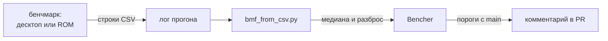

Часовую лупу я в эти две недели почти не снимал со лба. Я пишу движок ToyGine2 для небольших игр, которые должны запускаться и на современных машинах, и на приставках с моей полки. Цикл ушёл на строки: чтобы они собирались на Mega Drive, вели себя как стандартные, а их скорость можно было измерить.

<!-- truncate -->

[Коротко](#short) · [Mega Drive без libc](#md-libc) · [StringView против std::string_view](#string-view) · [Бенчмарки для приставок](#benchmarks) · [Цифры](#numbers) · [Что дальше](#next)

## Коротко {#short}

У `StringView` появились поиск, сравнение и подсчёт символов UTF-8, и всё это собирается на Mega Drive, для которой пришлось дописать недостающую часть libc. Сверка со `std::string_view` перебором нашла 27 расхождений и одно падение, теперь их ноль. У движка появились бенчмарки на nanobench и конвейер, который отправляет результаты в Bencher, а для приставок заложен собственный замерщик без плавающей точки. Всё это вошло в версию 26.19.0: [релиз на GitHub](https://github.com/ToymanInteractive/toygine2/releases/tag/26.19.0).

- `CStringView` переименован в `StringView`.
- Обработчик ассертов отвечает `true`, когда выполнение надо остановить, как `_CrtDbgReport` у Microsoft.
- Встроенный раннер тестов печатает результаты в формате TAP 14, текстовом протоколе для тестов.
- `toy::utf8Len()` считает символы UTF-8, `toy::validateUtf8()` проверяет строку по таблице 3-7 стандарта Юникода.
- Появились `application::Version` со сравнением, `log::Level` с потолком `LOG_MAX_LEVEL` и `log::Metadata`.
- `FixedStringStorage` и концепт `StringStorage` — основа для будущей строки без кучи.
- ckdl и заголовки Vulkan лежат в `thirdparty/`, куда переехал и прежний `extern/`. Редактор попал в артефакты CI.
- Для редактора спроектирован манифест проекта: спека #78 и восемь задач, #79–#86.
- Обработчики ассертов в тестах больше не бросают исключение из `noexcept`-функции, которое убивало весь тестовый бинарь.
- Сборки macOS снова получают `-O2`, `-g` и `NDEBUG`: их молча перекрывали пустые переменные флагов.

## Mega Drive без libc {#md-libc}

Сборка Mega Drive в CI упала на `#include <cstring>`. Заголовок из ClownMDSDK, набора для разработки под эту приставку, не компилировался вообще: в нём стояло `using memcpy;` без квалификации. Обойти его вызовом `::strncpy` тоже не вышло: `strncpy` в SDK не было вовсе — ни объявления, ни реализации.

Дальше выяснилось, что `libc.a` в SDK — заглушка на 1824 байта. В ней ровно три функции: `memcpy`, `memmove` и `memset`, то есть те, вызовы которых GCC генерирует сам. Не было `memcmp`, `memchr` и `strlen`, на которые опирается `std::char_traits<char>`, а за ним и весь `StringView`.

Решение легло в репозиторий движка, поверх установленного SDK. Это оверлей: свои `string.h` и `cstring`, которые стоят в путях поиска раньше SDK, и свой `string.c`, который компилируется в библиотеку движка. Платформенных `#ifdef` в коде не прибавилось: шов проходит по границе файлов. По map-файлу я проверил, что перекрытие работает и на линковке: `memcpy` и `strncpy` приходят из библиотеки движка, а `libc.a` загружается и не отдаёт ни одного члена.

Каждую новую функцию я сверил с системной libc перебором: все строки из четырёх символов алфавита `{a, b, c, \0}`, все пары, все длины от нуля до пяти, все 128 значений символа. Расхождений не нашлось. В апстриме попалась ошибка похуже пропущенных функций: `cstdlib` нёс include guard от `cstring`, и после `<cstring>` заголовок `<cstdlib>` молча выпадал целиком. Правки лежат в моём форке SDK, PR в апстрим пока не открыт.

Одну ошибку я сделал сам. Оверлею я выставил диалект `-std=gnu17` и записал в комментарии, что в `string.c` есть `asm`-вставки, которых нет в строгом C17. Через три дня выяснилось, что `asm`-вставок там не было ни тогда, ни потом. Флаг я снял, оверлей собирается под `-std=c17`, и ROM вышел того же размера.

Набор для консоли без операционной системы обещает меньше, чем кажется по именам его заголовков: `cstring` в дереве SDK ещё не значит, что его кто-то хоть раз подключал. Для того, кто пишет игру под Mega Drive, изменилось вот что: стандартные строковые функции работают, и код движка, написанный для десктопа, собирается там без платформенных веток.

## StringView против std::string_view {#string-view}

`StringView` — вид на строку с нулевым терминатором. Он родственник `std::string_view`, но вдобавок гарантирует `c_str()`. За цикл у него появились доступ к символам, `compare`, `starts_with` и всё семейство поиска: `find`, `rfind`, `find_first_of` и соседи, у каждого по четыре перегрузки. Поведение должно совпадать со стандартным до байта, а тесты на ручных примерах этого не доказывают.

Первую ошибку нашла красная фаза, ещё до всяких сверок. У всех девяти перегрузок обратного поиска по умолчанию стояло `pos = 0`, а обратный поиск ограничивает сверху позицию начала совпадения. С нулём `rfind("abra")` находил совпадение только в самом начале строки. Теперь по умолчанию стоит `npos`, как в стандарте.

Потом я написал дифференциальный харнесс: одни и те же входные данные идут в `toy::StringView` и `std::string_view`, результаты сравниваются. Так новую шестерню не меряют линейкой, а ставят на одну ось с заводской и прокручивают обе: где зуб не совпал, видно сразу. Первый прогон по поиску, на всех строках до четырёх символов алфавита `{a, b, c}` и на всех позициях, расхождений не дал.

Второй прогон я собрал без `_DEBUG`, то есть с выключенными ассертами, и добавил в него позиционные `compare` со счётчиками вплоть до `npos`. Он нашёл 27 расхождений и упал. Минимальный пример — `a.compare(0, npos, b, 0, npos)`: второй счётчик не ограничивался длиной, и в `memcmp` уходило `SIZE_MAX` байт. `std::string_view` на том же вызове возвращает ноль. Из 27 расхождений 19 давала пятиаргументная перегрузка: при двух пустых частях и разных счётчиках она объявляла левую часть меньшей. Счётчики теперь обрезаются длиной, как в стандарте, и расхождений ноль. Прогон по остальному API под ASan и UBSan тоже чист.

Сами тесты я проверял мутациями: портил метод и смотрел, заметит ли набор. На итераторах набор поймал восемь поломок из восьми, на поиске три прошли молча. Одна из них касалась символа со старшим битом: ни один из 122 тестов не гонял его через поиск по набору. Для каждой появился свой кейс.

Харнесс проверяет ровно то, что в нём перечислено: первый прогон был чистым, потому что до `npos` в счётчиках он не доходил. Для того, кто пишет игру, поиск и сравнение в `StringView` дают те же ответы, что и стандартные, в том числе на пустых строках и на `npos`.

## Бенчмарки для приставок {#benchmarks}

Поиск в `StringView` работал правильно, но о его скорости я не знал ничего: в каталоге `benchmarks/` не было ни одного бенчмарка. Мерить нужно было на десктопе и на приставках, а там nanobench не соберётся: ему нужны часы хоста, iostreams и плавающая точка, и ничего из этого у 68000 и ARM7 нет.

Начал я с nanobench на десктопе: один бинарь, кейсы регистрируются сами. Первые числа я снимал с отладочной сборки, где нет ни одного `-O`: одна и та же правка давала там ускорение в 14 раз, а в release — в 8. С тех пор правило записано: мерить только release.

Замеры сразу окупились. `find` перешёл на поиск первого символа через `traits_type::find` и ускорился с 405 до 55,7 нс. Для `rfind` я чуть не перенёс стратегию libc++, которая сканирует вперёд и запоминает последнее совпадение. Кейс с иглой в конце четырёхкилобайтного текста показал цену: 4,08 нс у обратного прохода против 992 нс у libc++. Обратный проход остался, а каждую позицию я удешевил проверкой первого и последнего байта иглы до сравнения.

На десктопе nanobench печатает таблицу, а раннер для приставок — строки CSV с целыми числами: тики таймера и число вызовов. Медиану и разброс считает скрипт на хосте CI, он же собирает отчёт для Bencher. Позже я ужал формат: имена кейса и строки таблицы пишутся один раз, а не в каждой эпохе. Я выбрал 7 эпох вместо 11 не по статистике: строка отладочного лога mGBA обрезается на 256 байтах, и при 11 эпохах худшая строка не помещается.

Часы на приставках разные. На GBA это Timer 2 без делителя, каскадом в Timer 3, чтобы 16-битный счётчик не переполнялся внутри эпохи. На Mega Drive — счётчик кадров плюс счётчик строк видеочипа. Внутри VBlank счётчик строк повторяет значения, поэтому отметка времени там стоит на месте, как в SGDK. Барьер оптимизатора `sink = &value` не работал: судя по ассемблеру, AppleClang, `m68k-elf-gcc` и `arm-none-eabi-gcc` удаляли вычисление целиком. Его заменила пустая `asm volatile`-вставка.

Одну странность я так и не объяснил. Четыре сборки подряд состав кейсов в бинаре менял замер `compare` с 3,99 до 26,48 нс, а на пятой эффект пропал. Нагрузку на процессор и выравнивание стека я проверил и исключил. Поэтому числа я сравниваю только внутри одной таблицы одной сборки, где строка `std` служит контролем.

Таблица символов для find_*_of: сделал и откатил

Маска на 256 бит вместо пересканирования набора на каждый байт ускорила `find_first_of` и соседей в 3,7–4,3 раза и сделала их в 3–6 раз быстрее `std`. Проверить её на приставках было нечем. На ARMv4T проверка по маске стоит 12 инструкций при 64-битных словах против 6 при 32-битных, а на 68000 переменный сдвиг стоит 8 + 2n тактов на каждый байт. Я откатил её целиком и вернусь к ней, когда заработает консольный раннер.

Число без условий сборки ничего не значит: отладочная сборка врёт, соседние кейсы влияют, и замер держит честным только строка `std` рядом. На `main` прогоны задают пороги, и PR сравнивается с ними. Алерт не блокирует мерж, он остаётся пометкой в комментарии. Для того, кто пишет игру, у движка появился способ узнать, во что обходится вызов, и тот же `*.benchmark.cpp` потом поедет на GBA и Mega Drive.

## Цифры {#numbers}

| Что мерил                 | Было                   | Стало                |
| ------------------------- | ---------------------- | -------------------- |
| `find(s, pos, count)`     | 405 нс                 | 55,7 нс              |
| `find(char, pos)`         | 40,4 нс                | 5,12 нс              |
| `rfind`, 103 байта        | 165,9 нс               | 43,0 нс              |
| `rfind`, 4 КБ             | 6 524 нс               | 2 110 нс             |
| CSV-отчёт полного прогона | 287 строк, 22 651 байт | 27 строк, 6 418 байт |

Время поиска мерил на macOS в release.

## Что дальше {#next}

Хранилище и концепт готовы, дальше на них встанет сама строка `toy::String`. Тела бенчмарков переедут на собственный `Bench`, а для GBA и Mega Drive появятся раннеры, которые запустят их в эмуляторах. Остаётся и долг: `_DEBUG` пока определяется только для MSVC, и на остальных платформах ассерты в отладочной сборке не проверяют ничего.
