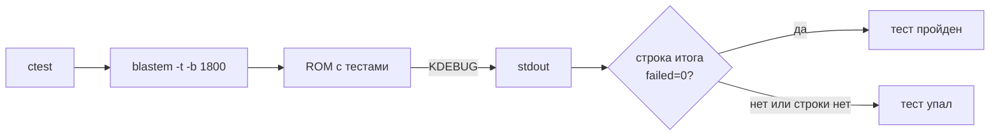

Две недели Mega Drive простояла не на полке, а на краю верстака. Я пишу движок ToyGine2 для небольших игр, которые должны запускаться и на современных машинах, и на приставках с этой полки. В этом цикле его тесты впервые прошли на Mega Drive, у строки фиксированного размера появилось присваивание, а сборка перестала ходить в сеть.

<!-- truncate -->

[Коротко](#short) · [Тесты на Mega Drive и GBA](#consoles) · [Строка, которая не влезла](#string) · [Все зависимости в репозитории](#vendoring) · [Цифры](#numbers) · [Что дальше](#next)

## Коротко {#short}

Модульные тесты движка теперь гоняются в CI под эмулятором Mega Drive, а на GBA — под свободным BIOS вместо встроенной подмены у mGBA. `toy::FixedString` получил конструкторы и присваивания по образцу `std::basic_string` и по-прежнему не трогает кучу. В сборке не осталось ни одного `FetchContent`: все зависимости лежат в репозитории. Всё это вошло в версию 26.20.0: [релиз на GitHub](https://github.com/ToymanInteractive/toygine2/releases/tag/26.20.0).

- Docker-образы тулчейнов MD и GBA собираются на нативных arm64-раннерах GitHub вместо QEMU.
- Появился образ тулчейна для N64: libdragon с ветки `preview` и GCC 16.2.
- Два тестовых бинаря движка слились в один, а раннер теперь задаётся опцией `TOYGINE_TESTS_RUNNER`.
- У редактора своя тестовая цель `editor-units` и первый кусок модели проекта — реестр настроек.
- Бенчмарки пишутся через `toy::benchmark::Bench`: на десктопе за ним стоит nanobench, а где nanobench нет — встроенный замерщик, который потом поедет на консоли.
- Bencher комментирует PR только при алерте и только по Linux x64; раньше приходило семь одинаковых отчётов.
- Из `toy::` убраны реэкспорты `std::array`, `std::char_traits`, `std::min` и ещё пяти имён: теперь они пишутся через `std::`. Это ломает совместимость.

## Тесты на Mega Drive и GBA {#consoles}

На GBA тесты движка к тому времени уже месяц гонялись в CI под mGBA. Для Mega Drive я собрал эмулятор BlastEm в Docker-образ тулчейна и включил такой же прогон. Шаг CI стабильно падал по таймауту: `units-builtin ***Timeout 60.06 sec`, и ни одной строки вывода.

Первый круг я сделал прямо в CI, временным шагом с `set -x` и `blastem -h`. Узнал немного: флага `-b`, который прогоняет заданное число кадров без окна, в справке нет, а вывода нет вовсе. Дальше разведка ушла в локальный контейнер, где сборка ROM и прогон занимают около секунды.

Решила дело лесенка по кадрам. `-b 5` выходил сразу и с нулевым кодом, `-b 60` и `-b 1800` висели до таймаута. Значит, кадры считаются и эмуляция жива, а встаёт всё там, где раннер печатает первую строку отчёта.

ROM пишет строки отчёта в отладочный регистр видеочипа, а BlastEm печатает их как `KDEBUG MESSAGE`. Перед каждой такой печатью он зовёт `init_terminal()`. Если stdin и stdout не подключены к терминалу, BlastEm закрывает стандартные потоки, форкает xterm и ждёт на FIFO, пока тот подключится. В контейнере CI нет X-сервера, xterm не стартует, и процесс ждёт вечно, уже без stdout. Отсюда и пустой лог. Лечит всё флаг `-t`, которого в `blastem -h` тоже нет: оба флага я нашёл только в исходниках.

Когда зависание ушло, открылась вторая дыра. BlastEm всегда выходит с кодом 0, а проверки вывода у теста не было, так что после `-t` тест зеленел бы при любом числе провалов. Теперь вердикт выносится по тексту вывода.

Строку `# assertions passed=N failed=0` раннер печатает последней, поэтому одна регулярка в `PASS_REGULAR_EXPRESSION` ловит и проваленные проверки, и прогон, оборванный на середине. Я проверил её на старом ROM, где одна проверка падала: тест покраснел, CTest вернул 8 и выложил в лог весь отчёт.

На GBA в тот же цикл появился полноценный BIOS. Раньше mGBA подменял его своей эмуляцией, теперь в образе лежит emibios — свободная замена оригинальному BIOS. Первый прогон с ним вывалил в лог 192 строки `GBA DMA` от заставки. Флаг `-C skipBios=1` пропускает заставку, а системные вызовы по-прежнему идут через код BIOS. Цена — загрузка через BIOS в CI больше не проверяется.

Первые гипотезы: мёртвый 68000 и битый заголовок картриджа

Пока лог был пустым, я подозревал сам ROM: что процессор не стартует или заголовок картриджа собран неправильно. Флаг `-l` должен был записать трассу адресов, но файл оставался пустым: процесс убивали раньше, чем он успевал сбросить буфер. Обе гипотезы сняла лесенка по кадрам. Мёртвый процессор не дожил бы до выхода на пятом кадре.

Эмулятор в CI — такая же зависимость, как компилятор, и у него есть поведение без терминала, которое нигде не описано. Коду возврата эмулятора я теперь не верю, пока не увижу, как тест падает. Для того, кто пишет игру на движке, изменилось вот что: каждый PR прогоняет 65 кейсов и 391 проверку на эмулированных 68000 и ARM7, и ошибка, которая живёт только на 68000, всплывёт до мержа.

## Строка, которая не влезла {#string}

`toy::FixedString<N>` — строка с буфером фиксированного размера внутри самого объекта, кучи она не трогает. За цикл у неё появились все конструкторы и присваивания из `std::basic_string`. Сразу встал вопрос, которого у стандартной строки нет: что делать, когда текст не влез. `std::string` бросает `std::length_error`, а в движке исключения выключены.

Я взял за образец гарантии стандарта, насколько их можно повторить без исключений. При `length_error` объект `std::string` просто не создаётся, частичного результата нет. Поэтому конструктор, которому не хватило места, в отладочной сборке останавливается на `assert_message`, а в релизной оставляет строку пустой. Обрезать до `capacity()` я не стал: такой полуправды у стандарта нет. С присваиванием иначе. Строка там уже жила, и отказ хранилища оставляет её прежней.

Потом я занялся ценой копии. `FixedString` по умолчанию копирует весь буфер. Для строки на 16 байт это дёшево: компилятор разворачивает копию в несколько инструкций. Для `FixedString<4096>` с восемью символами это четыре килобайта лишней работы. Хранилище теперь копирует буфер целиком до порога, а выше порога — только `size() + 1` байт. Как с коробками для винтиков: маленькую проще пересыпать целиком, а у большой быстрее переложить винтики из одних занятых ячеек.

Один порог на всех не подошёл. Порог в 64 байта бьёт по десктопу, где clang разворачивает и 72-байтовую копию, а порог в 72 — по GBA. Поэтому у каждой платформы теперь свой `platform_config.hpp` с константой `c_inlineCopyMaxBytes`. Для консолей значения я снял с кода, который генерирует GCC: от 28 до 60 байт. Для macOS прогнал сетку замеров и взял 128. Windows, Linux и Switch пока получили 128 по оценке, без замера.

Заодно конструктор хранилища перестал обнулять буфер и теперь пишет только терминатор. На GBA `FixedString<256>` потерял `memset` при каждом создании. Это сразу аукнулось: тест хранилища сравнивал весь буфер и упал на CI в оптимизированной сборке, прочитав неинициализированный хвост. Чинить пришлось тест.

Отдельный сюрприз ждал на Mega Drive. Урезанная libstdc++ в SDK ставит `<ranges>` без внутреннего `bits/binders.h`, и конструктор от пары итераторов не собирался. Файл я положил в оверлей SDK в репозитории как есть. После `-O2` от `ranges` в коде MD и GBA остаются только вычитание указателей и `memcpy`.

Быстрый путь для коротких строк: откатил

Идея была копировать короткую строку блоком фиксированного размера. Компилятор clang слил обе ветки в один `memmove` на `max(size, block) + 1` байт, и на macOS стало медленнее: 2,6–3,0 нс вместо 1,9. GCC для ARMv4T без `std::assume_aligned` копировал `char`-буфер вызовом функции, а `<memory>` ради этой подсказки добавлял к общему заголовку ядра 20% строк препроцессора. К тому же размер блока я привязал к `c_inlineCopyMaxBytes`, а это разные величины.

Без исключений у каждой операции должен быть явный ответ на вопрос «что остаётся после отказа», и лучший источник ответа — гарантии стандарта: они уже продуманы, их нужно только перевести. Для того, кто пишет игру, `FixedString` ведёт себя как `std::string` везде, где это возможно без кучи. Исход переполнения предсказуем: строка остаётся пустой или прежней, но обрезанной не бывает никогда.

## Все зависимости в репозитории {#vendoring}

До этого цикла CMake при конфигурации сам качал из сети doctest, volk и тему для Doxygen. Остальное уже лежало в `thirdparty/`, но каждый модуль там был устроен по-своему. Два способа сразу давали две версии правды: volk версии 1.4.350 приходил к заголовкам Vulkan 1.4.362.

Правило я перевернул. Раньше `FetchContent` был способом по умолчанию, теперь зависимости только вендорятся: копия лежит в `thirdparty/<имя>/`, рядом модуль `thirdparty/<имя>.cmake`, и все модули устроены одинаково.

В копию идёт только то, что собирается. У zlib осталось 20 файлов: файловый API `gz*` не нужен движку, у которого свой слой ввода-вывода. У libpng осталось 29 файлов из 380, у doctest — 4, у темы Doxygen — 11 из 41, без GIF на 5,6 МБ. Так я годами разбирал донорские приставки: забираешь исправную плату, а корпус и блок питания остаются на полке.

Вендоренный код собирается с проектными флагами, включая `-Werror`, без глушилки `-w`. Библиотеки zlib, libpng и volk прошли так без единого предупреждения. А вот ckdl не прошёл: 13 ошибок от `-Wbad-function-cast` и `-Wassign-enum`, так что `-w` остался только у него, с причиной в комментарии.

Одна ловушка была с doctest. Тестовые цели писали `include(doctest)` ради функции `doctest_discover_tests()` из помощника апстрима. Как только `thirdparty/` попал в путь модулей, по этому имени CMake стал находить мой новый `thirdparty/doctest.cmake`, и конфигурация упала на `Unknown CMake command "doctest_discover_tests"`. Разводить имена я не стал, а сделал модуль полной заменой: он создаёт цель и сам подключает помощник апстрима.

Вендоринг даёт сборку без сети, а урезанная копия под проектным `-Werror` ещё и заставляет решить, какой чужой код я готов читать и поддерживать. Цена тоже есть: обновлять копии теперь мне, а не `FetchContent`. Для того, кто собирает движок, главное вот что: после `git clone` конфигурация ничего не качает, а редактору не нужны ни сеть, ни Vulkan SDK.

## Цифры {#numbers}

| Что мерил                                          | Было                           | Стало           |
| -------------------------------------------------- | ------------------------------ | --------------- |
| Холодная сборка образа MD, amd64 / arm64           | ~233 мин одним джобом под QEMU | 15,6 / 13,3 мин |
| Прогон тестов GBA под emibios                      | 0,34 с с заставкой BIOS        | 0,01 с          |
| `assign` из однопроходного итератора, 1024 символа | 550–780 нс                     | 31–40 нс        |
| Копия короткой `FixedString`                       | 14–17 нс                       | 2,1–2,7 нс      |

Замеры `FixedString` снимал на macOS.

## Что дальше {#next}

Дальше бенчмарки поедут на приставки. Для MD и GBA нужны отчёт, таймер и свои раннеры, и только после этого станет видно, стоит ли переписывать поиск `find_first_of` в `StringView` на битовую маску. У образа N64 пока нет эмулятора, так что его тесты в CI не бегают. А реестр настроек в редакторе ждёт модели проекта, которая будет читать и писать манифест.
